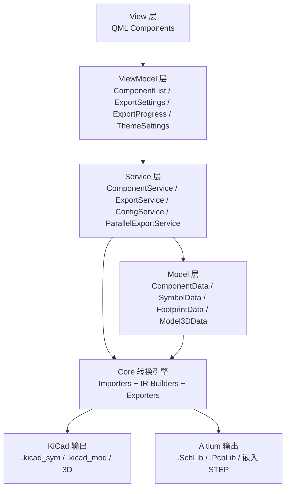
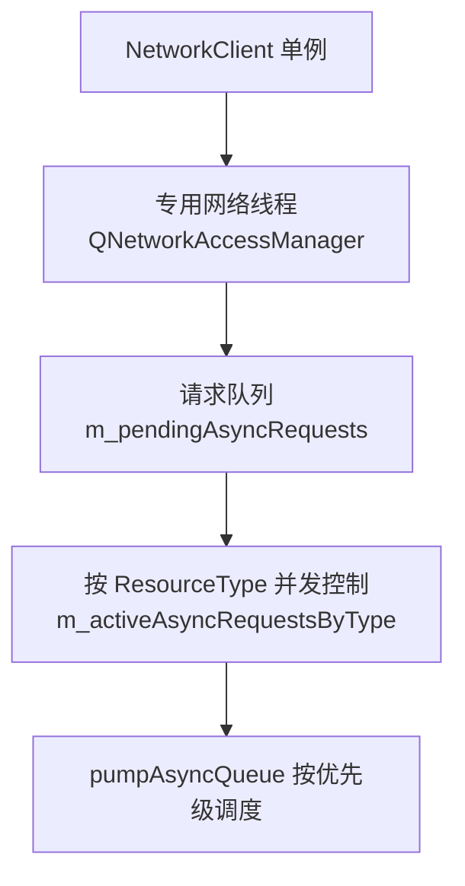
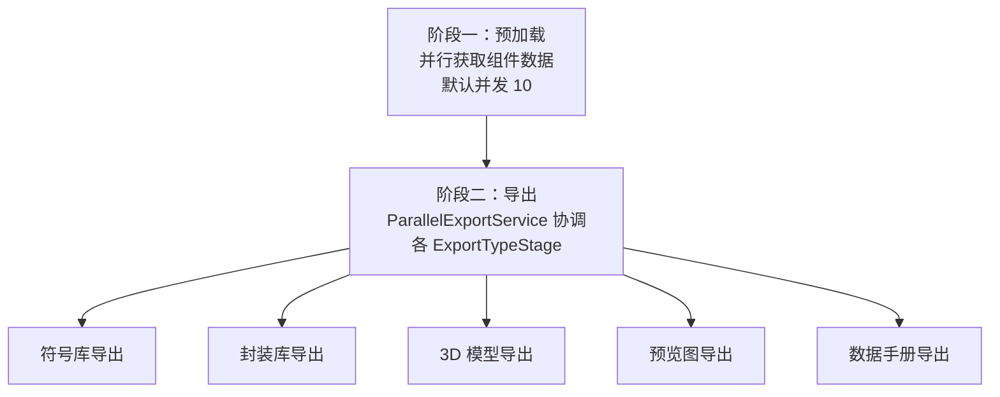
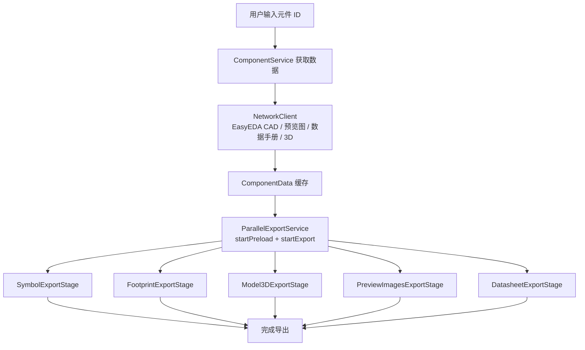

# 项目架构

本文档详细介绍 EasyKiConverter 项目的架构设计。

## 架构概览

EasyKiConverter 采用 MVVM (Model-View-ViewModel) 架构模式，支持 GUI 和 CLI 双模式运行，提供清晰的职责分离和高效的代码组织。

**双模式支持：**
- **GUI 模式**：QApplication + QML（默认模式）
- **CLI 模式**：QCoreApplication + CliConverter（纯命令行模式）

## 架构模式

### MVVM 架构

项目使用 MVVM 架构模式，将应用程序分为四个主要层次：



## 层次职责

### View 层（视图层）

View 层负责用户界面的展示和用户交互，使用 QML 实现。

**主要组件：**
- `MainWindow.qml` - 主窗口
- `components/Card.qml` - 卡片容器组件
- `components/ModernButton.qml` - 现代化按钮组件
- `components/Icon.qml` - 图标组件
- `components/ComponentListItem.qml` - 元件列表项组件
- `components/ResultListItem.qml` - 结果列表项组件
- `styles/AppStyle.qml` - 全局样式系统

**职责：**
- 界面布局和展示
- 用户输入接收
- 动画效果
- 主题切换

### ViewModel 层（视图模型层）

ViewModel 层负责管理 UI 状态和业务逻辑调用，作为 View 和 Model 之间的桥梁。

**主要类：**
- `ComponentListViewModel` - 元件列表视图模型
- `ExportSettingsViewModel` - 导出设置视图模型
- `ExportProgressViewModel` - 导出进度视图模型
- `ThemeSettingsViewModel` - 主题设置视图模型

**职责：**
- 管理 UI 状态
- 处理用户输入
- 调用 Service 层
- 数据绑定和转换

### Service 层（服务层）

Service 层负责业务逻辑的处理，提供核心功能。

**主要类：**
- `ComponentService` - 元件服务
- `ExportService` - 导出服务
- `ParallelExportService` - 并行导出服务（两阶段架构）
- `ConfigService` - 配置服务
- `PipelineCompletionHandler` - 导出完成处理器
- `CommandLineParser` - 命令行参数解析器
- `LcscImageService` - LCSC 预览图服务
- `BomParser` - BOM 文件解析器
- `CacheHealthManager` - 缓存自愈管理
- `CachePruner` - LRU 缓存淘汰
- `CadDataLoader` - CAD 数据解析
- `ComponentCacheService` - 组件缓存服务
- `ExportReportGenerator` - 导出报告生成
- `ExportWorkerHelpers` - 导出辅助函数

**职责：**
- 业务逻辑处理
- 数据验证
- 调用底层 API
- 管理转换流程
- 命令行参数处理（`CommandLineParser`）
- 网络图片获取
- BOM 文件导入

### CLI 模块（命令行接口）

CLI 模块位于 `src/utils/cli/` 目录，提供纯命令行模式支持。

**主要类：**
- `CliConverter` - CLI 主转换器
- `CliPrinter` - 命令行输出格式化
- `CliContext` - CLI 上下文管理
- `BaseConverter` - 转换器基类
- `BatchConverter` - 批量转换器
- `BomConverter` - BOM 批量转换
- `ComponentConverter` - 单元件转换
- `FileReader` - 文件读取
- `CompletionGenerator` - Shell 自动补全生成器

**职责：**
- 纯命令行模式运行（`convert` 子命令）
- Shell 自动补全支持（`--completion bash/zsh/fish`）
- BOM 批量导入转换（`convert bom <file>`）
- 单元件转换（`convert component <id>`）
- 批量转换（`convert batch <ids...>`）
- 离线批量导出

**CLI 命令示例：**
```bash
./easykiconverter convert bom BOM_FILE.xlsx           # BOM 文件转换
./easykiconverter convert component C12345             # 单个元件转换
./easykiconverter convert batch C12345 C67890          # 批量转换
./easykiconverter --completion bash > completion.sh    # 生成 bash 补全脚本
```

### Model 层（模型层）

Model 层负责数据的存储和管理。

**主要类：**
- `ComponentData` - 元件数据模型
- `SymbolData` - 符号数据模型
- `FootprintData` - 封装数据模型
- `Model3DData` - 3D 模型数据模型
- `ComponentListItemData` - 元件列表项数据模型（UI 数据模型）

**职责：**
- 数据存储
- 数据验证
- 数据序列化
- UI 状态管理（ComponentListItemData）

## 核心模块

### 转换引擎（Core）

转换引擎负责实际的转换工作，位于 `src/core` 目录。

**EasyEDA 模块：**
- `EasyedaApi` - EasyEDA API 客户端
- `EasyedaImporter` - 数据导入器
- `JLCDatasheet` - JLC 数据表解析

**KiCad 模块：**
- `ExporterSymbol` - 符号导出器
- `ExporterFootprint` - 封装导出器
- `Exporter3DModel` - 3D 模型导出器

**工具模块：**
- `GeometryUtils` - 几何计算工具
- `LayerMapper` - 图层映射工具
- `UrlUtils` - URL 规范化工具（统一预览图 URL 处理）
- `FileUtils` - 文件操作工具
- `PathSecurity` - 路径安全检查
- `NetworkClient` - 统一网络请求客户端（带重试和退避）
- `SvgPathParser` - SVG 路径解析
- `GzipUtils` - GZIP 压缩解压

### 网络架构（NetworkClient）

所有 HTTP 请求都通过 `NetworkClient` 单例处理，采用**专用网络线程 + 按 ResourceType 并发控制**的架构。

#### 架构概述



#### 关键实现细节

1. **单线程处理所有请求**：所有网络请求都在 `m_networkThread` 这一个线程中执行

2. **按 ResourceType 并发控制**：虽然只有一个网络线程，但通过 `m_activeAsyncRequestsByType` 跟踪每种资源类型的活跃请求数，确保不超过 `maxConcurrent` 限制

3. **同步请求也是异步实现**：`get()`/`post()` 同步方法内部也是调用 `enqueueAsyncRequest()` 入队，然后通过 `BlockingRequestContext::wait()` 阻塞等待结果

4. **请求调度**：`pumpAsyncQueue()` 方法会：
   - 清理已完成的请求
   - 按优先级和 ResourceType 的并发限制选择下一个请求
   - 通过 `QMetaObject::invokeMethod` 在网络线程中启动请求

#### ResourceType 并发配置

> 注：以下表格与源代码 `src/core/network/INetworkClient.h` 中的定义保持同步。

| ResourceType | maxConcurrent | 描述 |
|--------------|---------------|------|
| ComponentInfo | 10 | 组件元数据 JSON |
| CadData | 10 | CAD 数据 JSON（符号/封装） |
| PreviewImage | 5 | 组件预览图 |
| ProductSearch | 5 | LCSC 产品搜索 |
| Datasheet | 3 | PDF 数据手册 |
| Model3DObj | 3 | 3D 模型 OBJ 文件 |
| Model3DStep | 3 | 3D 模型 STEP 文件 |
| UpdateCheck | 2 | GitHub 发布元数据 |
| WorkerRequest | 5 | 通用工作线程请求 |

#### 请求者

- **EasyedaApi**：组件/CAD/3D 数据（使用 `NetworkClient::get()`）
- **LcscImageService**：预览图 + 数据手册（使用 `NetworkClient::getAsync()`）
- **ComponentService**：协调并行获取，通过 `m_maxConcurrentRequests` 控制并发

#### 使用模式

```cpp
// 同步请求（内部使用异步队列 + 阻塞等待）
RetryPolicy policy;
policy.maxRetries = 3;
policy.baseTimeoutMs = 30000;
NetworkResult result = NetworkClient::instance().get(url, policy);

// 带 ResourceType 的同步请求（使用预定义的 RequestProfile）
NetworkResult result = NetworkClient::instance().get(
    url, ResourceType::ComponentInfo, RetryPolicy::fromProfile(RequestProfiles::componentInfo()));

// 异步请求（返回 AsyncNetworkRequest*，调用方管理生命周期）
AsyncNetworkRequest* req = NetworkClient::instance().getAsync(url, ResourceType::PreviewImage);
connect(req, &AsyncNetworkRequest::finished, this, [req] /* capture */ (const NetworkResult& r) {
    if (r.success) { /* ... */ }
    req->deleteLater();  // 必须在完成后删除
});
```

#### 注意事项

- **不要在 bare std::thread 中使用**：NetworkClient 需要 Qt 事件循环
- **同步请求会阻塞调用线程**：但网络处理在专用线程中执行
- **生命周期管理**：异步请求返回的 `AsyncNetworkRequest*` 由调用方负责删除

### 工作线程（Workers）

工作线程负责后台任务处理，位于 `src/workers` 目录。

- `FetchWorker` - 网络数据获取工作线程
- `ProcessWorker` - 数据处理工作线程（CPU 密集型）
- `WriteWorker` - 文件写入工作线程
- `MediaFetchWorker` - 媒体文件获取工作线程
- `NetworkWorker` - 网络工作线程

## 导出架构

### 架构概述

项目实现了**两阶段导出架构**，用于批量导出元件数据，最大化性能。



### 阶段一：预加载（Preload）

**职责**：从网络获取所有原始数据

**实现**：
- 使用 `ComponentService::fetchMultipleComponentsData()` 并行获取
- 通过 `NetworkClient` 单例发起网络请求
- 使用专用网络线程 + QNetworkAccessManager
- 并发数由 `m_maxConcurrentRequests` 控制（默认 10）

**特点**：
- 数据获取在用户添加组件时就已经完成（验证阶段）
- 预加载只是从内存缓存中加载已验证的数据
- 支持重试/退避机制

---

### 阶段二：导出（Export）

**职责**：将数据转换并写入文件

**实现**：
- 使用 `ParallelExportService` 协调多个 `ExportTypeStage`
- 每种导出类型独立并行运行
- 每种类型有自己的线程池配置

**导出类型及并发配置**：

> 注：以下表格与 `ParallelExportService::createExportStages()` 中的线程池配置保持同步。

| 导出类型 | 最大并发数 | 说明 |
|----------|-----------|------|
| Symbol | 1 | 库级别导出，单线程 |
| Footprint | 1 | 库级别导出，单线程 |
| Model3D | 2 | 弱网时降为 1 |
| PreviewImages | 4 | 弱网时降为 2 |
| Datasheet | 2 | 弱网时降为 1 |

**特点**：
- 各类型独立并行，互不阻塞
- 库级别导出（Symbol/Footprint）使用单线程，避免文件写入冲突
- 支持弱网模式自动降级

---

### 数据流



---

## 设计模式

### 导出状态机模式

导出链路使用 `ExportItemStatus` 与 `ExportTypeProgress` 管理状态流转。

**状态：**
- Idle - 空闲状态
- Pending/InProgress - 执行中
- Completed - 已完成
- Error - 错误状态

### 两阶段导出策略

优化批量转换性能的两阶段策略。

**阶段一：预加载（并行）**
- 使用 `ComponentService::fetchMultipleComponentsData()` 并行获取所有元件数据
- 通过 `NetworkClient` 单例发起网络请求
- 并发数由 `m_maxConcurrentRequests` 控制（默认 10）
- 数据获取在用户添加组件时就已经完成（验证阶段）

**阶段二：导出（并行）**
- 使用 `ParallelExportService` 协调多个 `ExportTypeStage`
- 每种导出类型独立并行运行
- 库级别导出（Symbol/Footprint）使用单线程
- 其他类型根据网络状况动态调整并发数

### 单例模式

`ConfigService` 使用单例模式确保配置管理的一致性。

### 观察者模式

使用 Qt 信号槽机制实现观察者模式，实现组件间的松耦合通信。

## 数据流

### 用户交互流程

1. 用户在 View 层输入元件编号
2. ViewModel 接收用户输入，验证数据
3. ViewModel 调用 Service 层处理业务逻辑
4. Service 层调用 Core 层的转换引擎
5. Core 层返回转换结果给 Service 层
6. Service 层返回结果给 ViewModel
7. ViewModel 更新状态，View 自动刷新

### 转换流程

1. **数据收集阶段**
   - ComponentService 调用 EasyedaApi 获取元件数据
   - ParallelExportService 预加载缓存数据
   - 并行收集并准备导出输入

2. **数据导出阶段**
   - ParallelExportService 调用各 ExportStage 并行导出
   - Symbol/Footprint/Model3D/Preview/Datasheet 按类型并行
   - 实时更新进度状态

## 技术栈

### 编程语言
- C++17

### UI 框架
- Qt 6.10.1
- Qt Quick
- Qt Quick Controls 2

### 构建系统
- CMake 3.16+

### 多线程
- QThreadPool
- QRunnable
- QMutex

### 网络库
- Qt Network

### 压缩库
- zlib

## 目录结构

```
EasyKiConverter/
├── src/                        # 源代码
│   ├── main.cpp                # 应用程序入口
│   ├── core/                   # 核心转换引擎
│   │   ├── easyeda/            # EasyEDA 相关
│   │   ├── kicad/              # KiCad 相关
│   │   └── utils/              # 工具类
│   ├── models/                 # 数据模型
│   ├── services/               # 服务层
│   ├── ui/                     # UI 层
│   │   ├── qml/                # QML 界面 (包含 Main.qml)
│   │   │   ├── components/     # 可复用 QML 组件
│   │   │   │   ├── Card.qml
│   │   │   │   ├── ModernButton.qml
│   │   │   │   ├── ComponentInputCard.qml
│   │   │   │   ├── ComponentListCard.qml
│   │   │   │   ├── ComponentListItem.qml
│   │   │   │   ├── ExportSettingsCard.qml
│   │   │   │   ├── ExportProgressCard.qml
│   │   │   │   ├── ExportResultsCard.qml
│   │   │   │   ├── ExportStatisticsCard.qml
│   │   │   │   ├── ExportButtonsSection.qml
│   │   │   │   ├── TitleBar.qml
│   │   │   │   ├── HeaderSection.qml
│   │   │   │   ├── ResultListItem.qml
│   │   │   │   ├── ConfirmDialog.qml
│   │   │   │   ├── ExitDialog.qml
│   │   │   │   └── WindowResizeHandles.qml
│   │   │   └── styles/          # 全局样式
│   │   ├── viewmodels/         # 视图模型
│   │   └── utils/              # UI 工具
│   │       ├── ConfigManager.cpp/h      # 配置管理器
│   │       └── ThumbnailGenerator.cpp/h  # 缩略图生成器
│   └── workers/                # 工作线程
├── deploy/                     # 部署与打包 (Docker, Flatpak, nFPM)
├── docs/                       # 文档
├── resources/                  # 资源文件
├── test_data/                  # 测试用例与临时数据
└── tools/                      # 开发辅助脚本
```

## 扩展性

### 添加新的转换器

1. 在 `src/core/kicad/` 中创建新的导出器类
2. 继承相应的基类
3. 实现导出逻辑
4. 在 ExportService 中注册

### 添加新的 ViewModel

1. 在 `src/ui/viewmodels/` 中创建新的 ViewModel 类
2. 继承 QObject
3. 添加必要的属性和方法
4. 在 main.cpp 中注册到 QML 上下文

### 添加新的 Service

1. 在 `src/services/` 中创建新的 Service 类
2. 实现业务逻辑
3. 在 ViewModel 中调用

## 性能优化

### 并行处理

- 使用 QThreadPool 管理线程池
- 多线程并行数据收集
- 线程安全的数据访问

### 内存管理

- 使用智能指针管理资源
- RAII 原则
- 避免内存泄漏

### 网络优化

- 自动重试机制
- GZIP 解压缩
- 连接池管理

### BOM 导入与缓存命中路径的 UI 响应性约束

#### 背景

2026-04-19 修复过一个回归问题：导入**已有缓存**的 BOM 表时，界面会阻塞数秒；而无缓存时因为主要工作在网络线程中，反而没有明显卡顿。

#### 根本原因

问题不在“是否命中缓存”本身，而在**缓存命中后的后处理仍然跑在主线程**：

1. `ComponentService::loadComponentDataFromCacheAsync()` 虽然在后台线程读取了缓存文件，但返回主线程后仍对预览图执行 Base64 编码。
2. `LcscImageService::loadCachedPreviewImagesAsync()` 在缓存路径中逐张回放 `imageReady`，导致 UI 层重复进行图片解码/编码和多次刷新。
3. `ComponentListViewModel` 的 BOM 导入状态 `m_bomImportComplete` 一度只置位不复位，后续导入/刷新/重试会走错误分支，放大列表更新频率。

#### 设计约束

后续修改 BOM 导入、缓存加载、预览图展示链路时，必须遵守以下约束：

- 缓存命中路径必须与网络路径一样，默认视为“批量高开销路径”，不能在主线程做大块 I/O 或 CPU 工作。
- 预览图文件读取、Base64 编码、CAD JSON 解析、metadata 合并与磁盘写入，必须放在后台线程执行。
- 主线程只负责：
  - 更新轻量状态
  - 发射批量信号
  - 驱动 `QAbstractListModel` / QML 刷新
- 缓存预览图优先走 `previewImagesReady` 这类**批量信号**，避免逐张 `imageReady` 触发级联刷新。
- BOM 导入相关状态机（`m_bomImportMode` / `m_listUpdatePending` / `m_bomImportComplete`）必须在导入完成、清空列表、单项刷新、批量重试等入口显式复位。

#### 代码落点

- `src/services/ComponentService.cpp`
  - 缓存预览图的 Base64 编码必须在后台线程完成，再回到主线程发 `previewImagesReady`。
- `src/services/LcscImageService.cpp`
  - 缓存图片批量加载完成后，不再逐张补发 `imageReady`。
- `src/ui/viewmodels/ComponentListViewModel.cpp`
  - BOM 导入结束后只做必要的批量 UI 更新。
  - 状态变量必须在新一轮导入/重试开始前复位。
- `src/services/ComponentCacheService.cpp`
  - metadata 保存保持异步，避免批量缓存命中后同步落盘拖慢 UI。

#### 回归检查清单

如果后续再次出现“有缓存比没缓存更卡”的现象，优先检查：

1. 是否把缓存文件读取后的 CPU 工作又挪回了主线程。
2. 是否从批量信号退化回了逐项信号。
3. 是否在 BOM 导入期间频繁调用 `scheduleListUpdate()` / `recomputeStateCounters()`。
4. `m_bomImportComplete`、`m_bomImportMode`、`m_listUpdatePending` 是否存在漏复位。
5. 是否新增了同步磁盘写入、同步图片编码、同步 JSON 解析等逻辑。

### 弱网容错（v3.0.4 分析）

项目存在多套网络请求实现，弱网容错能力不一致：

- **`NetworkClient`**（统一网络层）：支持超时、重试和指数退避，已整合到 ComponentService
- **`ComponentService`**（LCSC 预览图）：支持超时（15s）+重试，有 Fallback 备用方案

> 注：`NetworkUtils` 源码已移除，其功能已整合到 `NetworkClient` 统一网络层。

已知问题及改进方向详见 [弱网支持分析报告](../project/archive/WEAK_NETWORK_ANALYSIS.md) 和 [ADR-007](../project/adr/007-weak-network-resilience-analysis.md)。

## 安全性

### 输入验证

- 元件编号格式验证
- 文件路径验证
- 配置参数验证

### 错误处理

- 异常捕获
- 错误日志
- 用户友好的错误提示

## 可维护性

### 代码规范

- 遵循 Qt 编码规范
- 使用 Doxygen 注释
- 代码审查

### 文档完整

- API 文档
- 架构文档
- 用户指南
