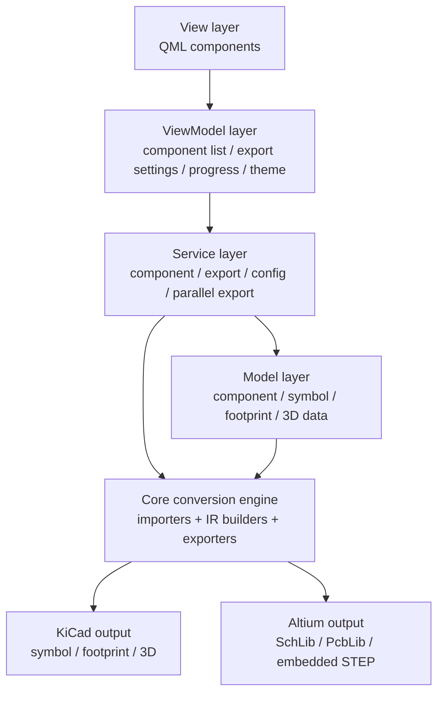

# Project Architecture

This document provides a detailed description of the EasyKiConverter project architecture design.

## Architecture Overview

EasyKiConverter uses the MVVM (Model-View-ViewModel) architecture pattern, providing clear separation of concerns and efficient code organization.

## Architecture Pattern

### MVVM Architecture

The project uses the MVVM architecture pattern, dividing the application into four main layers:


<!-- Legacy ASCII diagram retained below for historical reference.
```
┌─────────────────────────────────────────┐
│              View Layer                  │
│         (QML Components)                 │
│  - src/ui/qml/Main.qml                  │
│  - MainWindow.qml                        │
│  - Components (Card, Button, etc.)       │
│  - Styles (AppStyle)                     │
└──────────────┬──────────────────────────┘
               │
┌──────────────▼──────────────────────────┐
│          ViewModel Layer                │
│  ┌──────────────────────────────────┐   │
│  │ ComponentListViewModel          │   │
│  │ - Manages component list state   │   │
│  │ - Handles user input             │   │
│  │ - Calls ComponentService         │   │
│  └──────────────────────────────────┘   │
│  ┌──────────────────────────────────┐   │
│  │ ExportSettingsViewModel         │   │
│  │ - Manages export settings state  │   │
│  │ - Handles configuration changes  │   │
│  │ - Calls ConfigService            │   │
│  └──────────────────────────────────┘   │
│  ┌──────────────────────────────────┐   │
│  │ ExportProgressViewModel         │   │
│  │ - Manages export progress state  │   │
│  │ - Displays conversion results    │   │
│  │ - Calls ExportService            │   │
│  └──────────────────────────────────┘   │
│  ┌──────────────────────────────────┐   │
│  │ ThemeSettingsViewModel          │   │
│  │ - Manages theme settings state   │   │
│  │ - Handles dark/light mode toggle │   │
│  │ - Calls ConfigService            │   │
│  └──────────────────────────────────┘   │
└──────────────┬──────────────────────────┘
               │
┌──────────────▼──────────────────────────┐
│           Service Layer                  │
│  ┌──────────────────────────────────┐   │
│  │ ComponentService                 │   │
│  │ - Component data retrieval       │   │
│  │ - Component validation           │   │
│  │ - Calls EasyedaApi               │   │
│  └──────────────────────────────────┘   │
│  ┌──────────────────────────────────┐   │
│  │ ExportService                    │   │
│  │ - Symbol/footprint/3D export     │   │
│  │ - Parallel conversion management │   │
│  │ - Calls Exporter*                │   │
│  └──────────────────────────────────┘   │
│  ┌──────────────────────────────────┐   │
│  │ ConfigService                    │   │
│  │ - Configuration load/save        │   │
│  │ - Theme management               │   │
│  │ - Calls ConfigManager             │   │
│  └──────────────────────────────────┘   │
│  ┌──────────────────────────────────┐   │
│  │ ParallelExportService            │   │
│  │ - Preload and export orchestration│  │
│  │ - Multi-type parallel export      │  │
│  │ - Unified progress aggregation    │  │
│  └──────────────────────────────────┘   │
└──────────────┬──────────────────────────┘
               │
┌──────────────▼──────────────────────────┐
│            Model Layer                   │
│  ┌──────────────────────────────────┐   │
│  │ ComponentData                    │   │
│  │ - Component basic info           │   │
│  │ - Symbol/footprint/3D data       │   │
│  └──────────────────────────────────┘   │
│  ┌──────────────────────────────────┐   │
│  │ SymbolData                       │   │
│  │ - Symbol geometry data           │   │
│  │ - Pin information                │   │
│  └──────────────────────────────────┘   │
│  ┌──────────────────────────────────┐   │
│  │ FootprintData                    │   │
│  │ - Footprint geometry data        │   │
│  │ - Pad information                │   │
│  └──────────────────────────────────┘   │
│  ┌──────────────────────────────────┐   │
│  │ Model3DData                      │   │
│  │ - 3D model data                  │   │
│  │ - Model UUID                     │   │
│  └──────────────────────────────────┘   │
└─────────────────────────────────────────┘
```
-->

## Layer Responsibilities

### View Layer

The View layer is responsible for UI display and user interaction, implemented using QML.

**Main Components:**
- `MainWindow.qml` - Main window
- `components/Card.qml` - Card container component
- `components/ModernButton.qml` - Modern button component
- `components/Icon.qml` - Icon component
- `components/ComponentListItem.qml` - Component list item component
- `components/ResultListItem.qml` - Result list item component
- `styles/AppStyle.qml` - Global style system

**Responsibilities:**
- Interface layout and display
- User input reception
- Animation effects
- Theme switching

### ViewModel Layer

The ViewModel layer is responsible for managing UI state and calling business logic, serving as a bridge between View and Model.

**Main Classes:**
- `ComponentListViewModel` - Component list view model
- `ExportSettingsViewModel` - Export settings view model
- `ExportProgressViewModel` - Export progress view model
- `ThemeSettingsViewModel` - Theme settings view model

**Responsibilities:**
- Manage UI state
- Handle user input
- Call Service layer
- Data binding and conversion

### Service Layer

The Service layer is responsible for business logic processing, providing core functionality.

**Main Classes:**
- `ComponentService` - Component service
- `ExportService` - Export service
- `ParallelExportService` - Pipeline parallel export service
- `ConfigService` - Configuration service
- `PipelineCompletionHandler` - Export completion handler

**Responsibilities:**
- Business logic processing
- Data validation
- Call underlying APIs
- Manage conversion process

### Model Layer

The Model layer is responsible for data storage and management.

**Main Classes:**
- `ComponentData` - Component data model
- `SymbolData` - Symbol data model
- `FootprintData` - Footprint data model
- `Model3DData` - 3D model data model

**Responsibilities:**
- Data storage
- Data validation
- Data serialization

## Core Modules

### Conversion Engine (Core)

The conversion engine is responsible for actual conversion work, located in the `src/core` directory.

**EasyEDA Module:**
- `EasyedaApi` - EasyEDA API client
- `EasyedaImporter` - Data importer
- `JLCDatasheet` - JLC datasheet parser

**KiCad Module:**
- `ExporterSymbol` - Symbol exporter
- `ExporterFootprint` - Footprint exporter
- `Exporter3DModel` - 3D model exporter

**Utilities Module:**
- `GeometryUtils` - Geometry calculation utilities
- `NetworkUtils` - (deprecated, replaced by NetworkClient)
- `LayerMapper` - Layer mapping utilities

### Workers

Workers are responsible for background task processing, located in the `src/workers` directory.

- `ExportWorker` - Export worker thread
- `NetworkWorker` - Network worker thread

## Design Patterns

### Export State Machine Pattern

The export pipeline uses `ExportItemStatus` and `ExportTypeProgress` to model state transitions.

**States:**
- Idle - Idle state
- Pending/InProgress - Running state
- Completed - Completed state
- Error - Error state

### Two-Stage Export Strategy

Two-stage strategy to optimize batch conversion performance.

**Stage 1: Data Collection (Parallel)**
- Use multi-threading to collect all component data in parallel
- Fully utilize multi-core CPU performance
- Asynchronous network requests

**Stage 2: Data Export (Serial)**
- Serially export all collected data
- Avoid file write conflicts
- Ensure data consistency

### Singleton Pattern

`ConfigService` uses the singleton pattern to ensure configuration management consistency.

### Observer Pattern

Use Qt signal-slot mechanism to implement the observer pattern, achieving loose coupling between components.

## Data Flow

### User Interaction Flow

1. User inputs component number in View layer
2. ViewModel receives user input and validates data
3. ViewModel calls Service layer to process business logic
4. Service layer calls Core layer's conversion engine
5. Core layer returns conversion results to Service layer
6. Service layer returns results to ViewModel
7. ViewModel updates state, View automatically refreshes

### Conversion Flow

1. **Data Collection Stage**
   - ComponentService calls EasyedaApi to get component data
   - ParallelExportService preloads cached component data
   - Parallel data preparation for export inputs

2. **Data Export Stage**
   - ParallelExportService drives export stages in parallel
   - Symbol/Footprint/Model3D/Preview/Datasheet run by type
   - Real-time progress status updates

## Tech Stack

### Programming Language
- C++17

### UI Framework
- Qt 6.10.1
- Qt Quick
- Qt Quick Controls 2

### Build System
- CMake 3.16+

### Multi-threading
- QThreadPool
- QRunnable
- QMutex

### Network Library
- Qt Network

### Compression Library
- zlib

## Directory Structure

```
EasyKiConverter/
├── src/                        # Source code
│   ├── main.cpp                # Application entry point
│   ├── core/                   # Core conversion engine
│   │   ├── easyeda/            # EasyEDA related
│   │   ├── kicad/              # KiCad related
│   │   └── utils/              # Utilities
│   ├── models/                 # Data models
│   ├── services/               # Service layer
│   ├── ui/                     # UI layer
│   │   ├── qml/                # QML interface (contains Main.qml)
│   │   ├── viewmodels/         # View models
│   │   └── utils/              # UI utilities
│   └── workers/                # Worker threads
├── deploy/                     # Deployment & Packaging (Docker, Flatpak, nFPM)
├── docs/                       # Documentation
├── resources/                  # Resource files
├── test_data/                  # Test cases & Temporary data
└── tools/                      # Development scripts
```

## Extensibility

### Adding New Exporters

1. Create a new exporter class in `src/core/kicad/`
2. Inherit from the corresponding base class
3. Implement export logic
4. Register in ExportService

### Adding New ViewModels

1. Create a new ViewModel class in `src/ui/viewmodels/`
2. Inherit from QObject
3. Add necessary properties and methods
4. Register to QML context in main.cpp

### Adding New Services

1. Create a new Service class in `src/services/`
2. Implement business logic
3. Call in ViewModel

## Performance Optimization

### Parallel Processing

- Use QThreadPool to manage thread pool
- Multi-threaded parallel data collection
- Thread-safe data access

### Memory Management

- Use smart pointers for resource management
- RAII principles
- Avoid memory leaks

### Network Optimization

- Automatic retry mechanism
- GZIP decompression
- Connection pool management

### Weak Network Resilience (v3.0.4 Analysis)

The project has four independent network request implementations with inconsistent weak network resilience:

- **`FetchWorker`** (pipeline batch export): Supports timeout (8-10s) and retry (3x), but does not retry after timeout
- **`NetworkUtils`** (single component preview): Most complete weak network support with timeout (30s) + retry + incremental delays
- **`NetworkWorker`** (legacy single fetch): No timeout or retry mechanism; may block permanently under weak network conditions
- **`ComponentService`** (LCSC preview images): Supports timeout (15s) + retry with fallback mechanism

For known issues and improvement directions, see the [Weak Network Analysis Report](../project/archive/WEAK_NETWORK_ANALYSIS_en.md) and [ADR-007](../project/adr/007-weak-network-resilience-analysis_en.md).

## Security

### Input Validation

- Component number format validation
- File path validation
- Configuration parameter validation

### Error Handling

- Exception catching
- Error logging
- User-friendly error messages

## Maintainability

### Code Standards

- Follow Qt coding standards
- Use Doxygen comments
- Code review

### Documentation Completeness

- API documentation
- Architecture documentation
- User guide
