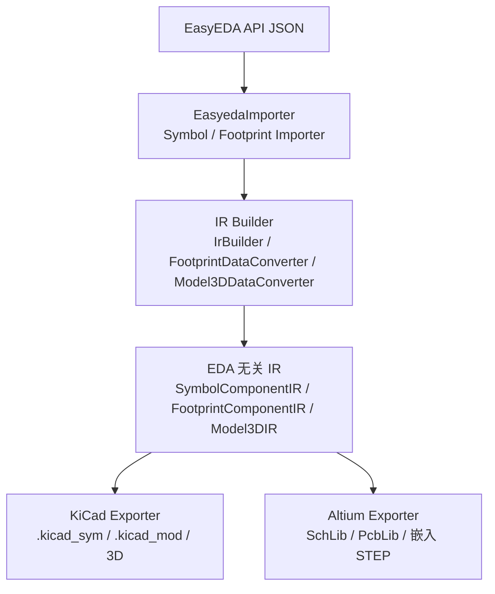
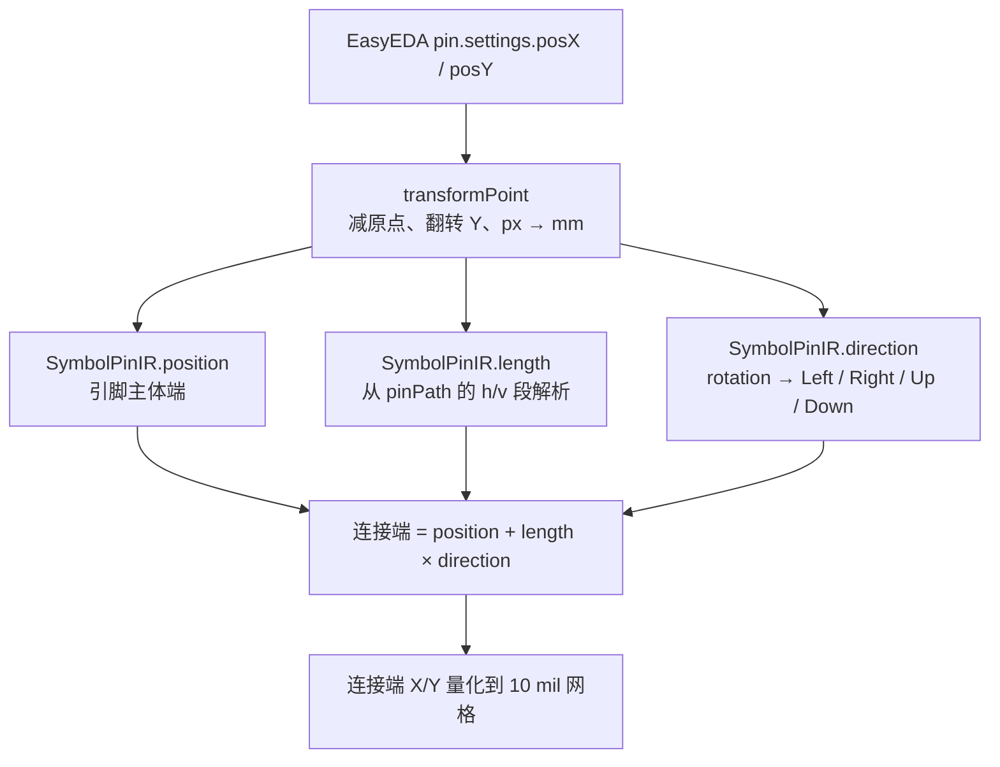

# 转换层算法与映射关系

本文说明 EasyKiConverter 如何把 EasyEDA 元件数据转换为内部中间表示（IR），以及 IR 如何被 KiCad、Altium 等目标格式导出。文中使用 LCSC 元件 C2040（RP2040）作为贯穿示例。

## 1. 设计边界

转换流程分为四层：



Importer 只负责理解 EasyEDA 数据；IR Builder 负责语义统一；Exporter 只负责目标格式语法和能力差异。新增格式时应复用 IR，不应重新解析 EasyEDA JSON。

## 2. 单位与坐标算法

### 2.1 单位

EasyEDA 图形坐标使用 10 mil 网格单位，当前换算常量定义在 `src/core/ir/IRTypes.h`：

| 来源数据 | IR 单位 | 换算 |
| --- | --- | --- |
| EasyEDA 坐标/长度 | mm | `value * 0.254` |
| EasyEDA 文本 pt | mm | `value * 0.352778` |
| 目标格式内部坐标 | 由 Exporter 再转换 | 例如 Altium 使用 mil 整数 |

所有 IR 几何字段均为 mm。这样可以避免在不同导出器之间传递 EasyEDA 的原始整数或字符串。

### 2.2 Y 轴翻转与原点

EasyEDA 的 Y 轴向下，KiCad 和 Altium 符号坐标约定为 Y 轴向上。单点变换为：

```text
x' = (x - originX) * 0.254
y' = -(y - originY) * 0.254
```

实现位于 `GeometryNormalizer::transformPoint()`。折线、多边形和路径先解析为点列表，再由 `transformPoints()` 批量执行相同变换。

符号原点不能使用“第一个引脚”推断。当前构建策略是：

1. 收集当前部件的矩形、圆、椭圆、弧、折线、多边形、路径以及引脚主体端和连接端。
2. 计算这些几何对象的完整边界框。
3. 以边界框中心作为符号局部原点。
4. 对引脚连接端按 10 mil 网格量化，并反推主体端，保持引脚长度不变。

这样可避免 C2040 这类第一个引脚位于左上侧时，整个符号被错误平移到第一脚附近。

## 3. C2040 符号转换示例

C2040 的 API 数据描述的是 RP2040，符号包含 57 个引脚和一个主体矩形。当前验证得到的主体边界为：

| 项目 | EasyEDA/验证值 |
| --- | --- |
| 主体左/右边界 | `X = -115 / +115 mil` |
| 主体上/下边界 | `Y = +200 / -180 mil` |
| 引脚总数 | 57 |
| 左侧引脚 | QSPI、XIN、XOUT、RUN、SWCLK、SWD 等 |
| 右侧引脚 | GPIO0~GPIO25、GPIO26_ADC0~GPIO29_ADC3、USB_DP/DM |
| 上侧引脚 | DVDD、VREG_VOUT、VREG_IN、IOVDD、USB_VDD、ADC_AVDD 等 |
| 下侧引脚 | TESTEN、GND |

以左侧 `QSPI_SS` 为例：



连接端必须落在网格交叉处，主体端允许在边界附近产生不超过半个网格的微小调整。C2040 原始数据已经位于网格上，因此量化不会改变 57 个引脚的最终坐标。

## 4. 符号字段映射

### 4.1 引脚

`IrBuilder::toSymbolIR()` 将 EasyEDA 引脚拆为几何、语义和显示三部分：

| EasyEDA 字段 | IR 字段 | 说明 |
| --- | --- | --- |
| `name.text` | `name` | 引脚名称 |
| `settings.spicePinNumber` | `designator` | 引脚编号 |
| `settings.posX/posY` | `position` | 主体端坐标 |
| `pinPath` 的水平/垂直段 | `length` | 引脚长度 |
| `settings.rotation` | `direction` | 四方向枚举 |
| `settings.type` | `electricalType` | 输入、输出、双向、无源、电源等 |
| `name.isDisplayed` | `display.showName` | 名称显示控制 |
| `settings.isDisplayed` | `display.showDesignator` | 编号显示控制 |
| `dot.isDisplayed` | `style.inverted` / `decoration` | 取反圆点 |
| `clock.isDisplayed` | `style.clock` / `decoration` | 时钟三角 |

`style` 表达电气语义，`decoration` 表达 IEEE 图形装饰，不能把两者混为一个目标格式字段。旧的 `hasDot`、`hasClock` 字段仅用于过渡兼容，新代码应读取 `style` 和 `display`。

### 4.2 图形与文本

| EasyEDA 对象 | IR 对象 | 主要处理 |
| --- | --- | --- |
| Rectangle | `SymbolRectangleIR` | 两个端点、描边、填充 |
| Circle | `SymbolCircleIR` | 圆心、半径 |
| Ellipse | `SymbolEllipseIR` | 圆心、X/Y 半径 |
| Arc | `SymbolArcIR` | 起点、中点、终点三点表示 |
| Polyline | `SymbolPolylineIR` | 解析为空间点列表 |
| Polygon | `SymbolPolygonIR` | 解析为空间点列表，可闭合填充 |
| SVG Path | `SymbolPathIR` | 解析为点序列；`Z` 命令闭合 |
| Symbol Text | `SymbolTextIR` | 位置、旋转、颜色、字体、可见性 |

文本布局由导出器独立处理：可见 Reference/Value 应围绕符号中心排列；隐藏属性集中放在符号底部；普通图形文本保留其相对位置。不能通过文本内容猜测属性身份，也不能以第一个引脚作为文本原点。

## 5. 封装与 3D 模型映射

`FootprintDataConverter` 负责把字符串和数字转换为 IR 枚举：

| EasyEDA 数据 | IR | 目标示例 |
| --- | --- | --- |
| `shape=RECT/ELLIPSE/OVAL/...` | `PadShape` | KiCad `rect/oval/roundrect` |
| `holeRadius > 0` | `PadType::ThroughHole` | KiCad `thru_hole` |
| `layerId` | `LayerType` | `F.Cu`、`B.Mask`、`Edge.Cuts` |
| SVG 线/弧/区域 | 点列表或圆弧参数 | 目标格式图元 |
| 3D URL/原始数据 | `Model3DIR` | STEP 嵌入或 KiCad model 引用 |

图层映射由 `EasyedaLayerMap`（来源层 → IR）和目标导出器（IR → 目标层）分两步完成。未知来源层必须显式降级到 `Unknown` 或目标用户层，并记录警告，不能静默当作铜层。

3D 模型属于独立导出能力：

- KiCad 可写入 STEP/WRL 文件并在封装中保存模型路径。
- Altium 目标优先写入支持的 STEP 数据并嵌入 PcbLib；不生成无效的 WRL 引用。
- 导出进度必须以实际写入结果统计，不能仅根据是否选择了 3D 选项判断成功。

## 6. 目标格式映射

### KiCad

`ExporterSymbol` 和 `ExporterFootprint` 将 IR 序列化为文本格式：

- `PinElectricalType` → KiCad `electrical_type`。
- `PinDirection` → 引脚起点/终点坐标和旋转角度。
- `PinDecoration::Dot/Clock` → KiCad 引脚图形样式；无法表达的装饰按语义最接近项降级。
- IR 的 mm 坐标直接输出为 KiCad mm，并保留 10 mil 网格对应的精度。
- 多部件符号按 `partIndex` 生成子符号，公共属性只写入允许的层级。

### Altium

`ExporterAltiumSymbol`、`ExporterAltiumFootprint` 先把 IR 转换为 Altium 模型，再由 OLE/CFB writer 写入二进制库：

- mm → mil 后写入 Altium 整数坐标。
- 引脚主体端、连接端和长度分别写入，保证连接点可编辑、可连线。
- `PinDecoration` 映射到 Altium 引脚的边缘样式字段（InnerEdge、OuterEdge、Inside、Outside）。
- 符号图元写入 `Header`、`Data` 和索引；封装图元写入 `PcbLib Header`、`Library/Data` 和模型关联结构。
- SchLib/PcbLib 元数据只写入本项目字段，不复制来源工具的作者或项目标志。

## 7. 精度、降级与错误策略

转换不是逐字段复制，而是语义保持优先：

1. 能直接表达的字段保持数值和几何精确一致。
2. 目标格式缺少对应能力时，选择最接近的合法表示，并记录可诊断警告。
3. 不能安全推断的字段使用明确默认值，不根据文本内容或对象顺序猜测。
4. 网格量化只作用于连接端；同组引脚应保持间距、方向和长度关系。
5. 任何文件写入失败都必须向导出结果传递失败状态。

## 8. 回归验证建议

以 C2040 为基准，建议每次修改转换层后验证：

- 57 个引脚数量、编号、名称、方向和连接端坐标。
- 主体矩形四条边与引脚主体端的相对关系。
- 可见/隐藏属性的锚点、顺序和中心布局。
- 引脚取反圆点、时钟三角和电气类型的映射。
- KiCad 文本 golden、Altium OLE 流结构和实际软件打开结果。
- STEP 模型的嵌入状态、原点和引脚对齐。

推荐测试分为三层：IR 语义测试、目标文件结构测试、EDA 软件视觉/交互验收。golden 文件只能证明序列化稳定，不能单独证明引脚可连线或模型可用。

## 9. 代码导航

| 职责 | 入口 |
| --- | --- |
| 通用枚举与单位 | `src/core/ir/IRTypes.h` |
| 坐标解析与变换 | `src/core/ir/GeometryNormalizer.h` |
| 符号 IR 构建 | `src/core/ir/IrBuilder.h` |
| 封装 IR 构建 | `src/core/ir/FootprintDataConverter.h` |
| EasyEDA 符号导入 | `src/core/easyeda/EasyedaSymbolImporter.*` |
| KiCad 符号导出 | `src/core/kicad/ExporterSymbol.*` |
| Altium 符号导出 | `src/core/altium/ExporterAltiumSymbol.*` |
| Altium SchLib 写入 | `src/core/altium/writers/AltiumSchLibWriter.*` |
| Altium PcbLib 写入 | `src/core/altium/writers/AltiumPcbLibWriter.*` |

代码实现发生变化时，应同步更新本文档中的公式、字段表和 C2040 验证数据。
