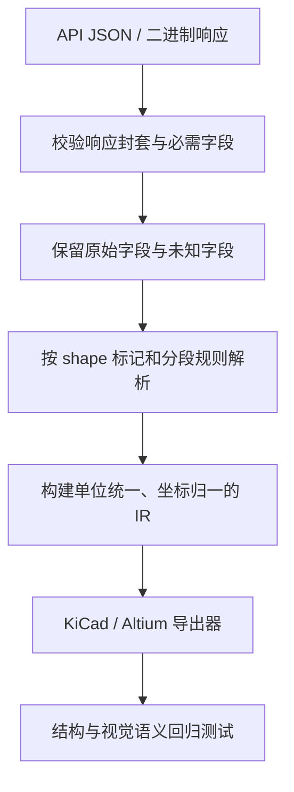

# EasyEDA API 原始数据说明

本文说明 EasyKiConverter 当前使用的 EasyEDA Pro API 响应结构，以及原始字段如何进入导入器。文档关注“原始数据长什么样”和“哪些字段会影响转换”，不把 EasyEDA 的私有接口当作稳定的公开协议。

## 1. 请求与响应边界

`EasyedaApi` 当前使用以下请求：

| 用途 | 请求 | 响应处理 |
| --- | --- | --- |
| 元件信息和 CAD | `GET https://easyeda.com/api/products/{lcscId}/components?version=6.5.51` | JSON 对象；`fetchComponentInfo()` 保留完整对象，`fetchCadData()` 提取 `result` |
| OBJ 模型 | `GET https://modules.easyeda.com/3dmodel/{uuid}` | 二进制，直接通过 `model3DFetched` 发出 |
| STEP 模型 | `GET https://modules.easyeda.com/qAxj6KHrDKw4blvCG8QJPs7Y/{uuid}` | 二进制，直接通过 `model3DFetched` 发出 |

请求统一经过 `NetworkClient`。JSON 解析失败、响应不是对象、HTTP 错误和取消都会通过 `fetchError` 报告；因此导入器收到的输入已经是合法 JSON 对象，但字段仍可能缺失或为空。

## 2. 顶层 JSON

典型 CAD 响应可以抽象为：

```json
{
  "success": true,
  "uuid": "<symbol uuid>",
  "title": "<symbol title>",
  "dataStr": { "head": {}, "BBox": {}, "shape": [] },
  "packageDetail": { "uuid": "<footprint uuid>", "dataStr": {} },
  "lcsc": { "url": "<product page>", "uuid": "<3d uuid>" },
  "subparts": []
}
```

字段并非每个元件都存在。当前代码采用“存在才读取”的策略：

- `success=false` 表示 API 业务错误。
- `result` 是 CAD 请求真正的数据容器；`EasyedaApi::handleCadDataResponse()` 会把 `lcscId` 注入到 `result` 后再发出。
- `dataStr` 描述符号或封装的编辑器数据。
- `packageDetail` 描述封装元数据和封装 `dataStr`。
- `lcsc` 提供数据手册、产品页和 3D UUID 等关联信息。
- `subparts` 存在且非空时，符号按多单元器件处理；每个单元有自己的 `dataStr`。

可对照仓库中的最小样例：[cad_basic.json](../../tests/fixtures/easyeda/cad_basic.json)、[symbol_basic.json](../../tests/fixtures/easyeda/symbol_basic.json) 和 [footprint_basic.json](../../tests/fixtures/easyeda/footprint_basic.json)。

## 3. `dataStr` 的公共部分

### 3.1 `head`

`head` 是编辑器和对象的元数据，不是几何本身：

| 字段 | 用途 | 当前映射 |
| --- | --- | --- |
| `editorVersion` | EasyEDA 编辑器版本 | `SymbolInfo/FootprintInfo.editorVersion` |
| `puuid` | 所属工程或父对象 UUID | `puuid` |
| `utime` | 更新时间戳 | `utime` |
| `importFlag`、`hasIdFlag`、`newgId` | 数据能力/兼容标志 | 对应布尔字段 |
| `x`、`y` | 缺少 `BBox` 时的回退位置 | 仅作为退化边界中心 |
| `c_para` | 元件参数字典 | 名称、料号、封装、厂商等 |
| `uuid_3d` | 封装关联的 3D UUID | `FootprintInfo.uuid3d` |

`head.x/y` 不能直接当作“第一个引脚原点”。符号转换会根据完整几何边界计算局部原点；这正是修复 C2040 以第一脚为中心问题的关键。

### 3.2 `c_para`

符号和封装共用参数字典，但字段集合取决于元件来源：

| 常见字段 | 符号 | 封装 |
| --- | --- | --- |
| `name` | 符号名称 | 通常不使用 |
| `pre` | 前缀，如 `R`、`U` | 不使用 |
| `package` | 封装名称 | 封装名称 |
| `Manufacturer`、`Manufacturer Part` | 厂商信息 | 可用于元数据 |
| `Supplier Part`、`Supplier` | LCSC 料号/供应商 | 可用于元数据 |
| `3DModel` | 不使用 | 3D 模型名称 |
| `link`、`Contributor` | 不使用 | 封装来源信息 |

缺失参数必须保持为空，不能凭名称猜测或写入第三方作者标志。

### 3.3 `BBox`

`BBox` 通常包含 `x`、`y`、`width`、`height`。这些值用于初始边界和原点推断，但最终符号边界还要结合矩形、路径、引脚主体端和连接端重新计算。封装模型原点则由封装边界与模型来源坐标共同归一化。

## 4. 符号 `shape` 编码

符号 `dataStr.shape` 是字符串数组，每个字符串以 `~` 分隔字段；引脚内部还使用 `^^` 分隔多个段。第一段标记对象类型：

| 标记 | 对象 | 导入器 |
| --- | --- | --- |
| `P` | 引脚 | `importPinData()` |
| `R` | 矩形 | `importRectangleData()` |
| `C` | 圆 | `importCircleData()` |
| `A` | 弧 | `importArcData()` |
| `PL` | 折线 | `importPolylineData()` |
| `PG` | 多边形 | `importPolygonData()` |
| `PT` | SVG/路径 | `importPathData()` |
| `T` | 文本 | `importTextData()` |
| `E` | 椭圆 | `importEllipseData()` |

### 4.1 引脚 `P`

引脚记录由多个 `^^` 段组成，当前解析位置如下：

| 段 | 字段 | 含义 |
| --- | --- | --- |
| 0 | `show~type~spicePinNumber~posX~posY~rotation~id~locked` | 几何、方向、电气类型和编号 |
| 1 | `dotX~dotY` | 引脚连接/端点辅助坐标 |
| 2 | `path~color` | 引脚主体路径和颜色 |
| 3 | `show~x~y~rotation~text~anchor~font~size` | 引脚名称文本 |
| 4 | `show~circleX~circleY~...~numberText` | 取反圆点辅助信息和显示编号 |
| 5 | 预留 | 当前不消费 |
| 6 | `show~path` | 时钟装饰路径 |

`settings.posX/posY` 表示引脚主体端；连接端由方向和长度推导，并在导出前量化到 10 mil 网格。`settings.type`、段 4 和段 6 分别参与电气类型、取反圆点和时钟装饰映射。字段不足时不能按下标强读，必须保留默认值。

### 4.2 文本 `T`

文本记录至少包含 16 个字段。当前布局为：`mark、x、y、rotation、color、font、size、bold、italic、reserved、baseline、type、text、visible、anchor、id、locked`。字段 11 是文本类型，字段 12 才是显示内容；误用字段 11 会把文本导出成 `comment` 等错误内容。

## 5. 封装 `packageDetail.dataStr`

封装几何同样位于 `shape` 字符串数组，但标记不同：

| 标记 | 主要字段 | 结果 |
| --- | --- | --- |
| `PAD` | 形状、中心、尺寸、层、编号、孔参数、旋转 | `FootprintPad` |
| `TRACK` | 线宽、层、网络、点串 | `FootprintTrack` |
| `HOLE` | 孔径和位置 | `FootprintHole` |
| `CIRCLE`、`ARC`、`RECT`、`TEXT` | 几何和显示属性 | 对应封装图元 |
| `SVGNODE` | JSON 编码的 SVG 节点树 | 3D/轮廓图元 |
| `SOLIDREGION` | 实心区域 | `FootprintSolidRegion` |

封装层由 `layers` 定义，图元可见性由 `objects` 定义。`PAD` 中的孔半径或孔长度大于零时，封装类型被判定为通孔（THT），否则通常为表贴（SMT）。

## 6. 多单元符号与 3D 关联

多单元响应的 `subparts[i].dataStr` 独立包含 `head` 和 `shape`。导入器为每个单元创建 `SymbolPart`，不会把不同单元的引脚或图形混在一起。

3D 下载不是 JSON：API 只返回二进制 OBJ/STEP。`lcsc.uuid` 或 `head.uuid_3d` 用于建立关联；目标格式是否嵌入以及是否额外写出文件，由具体导出器能力决定。

## 7. 演进与验证规则



当 EasyEDA 增加字段或改变分段顺序时，应先更新 fixture，再更新本说明和 importer 单元测试。不得依赖字段名称猜测对象类型，也不得静默丢弃无法识别的图元；未知标记应记录警告并保留原始字符串，便于后续升级。

## 8. 代码索引

- API 请求与响应封套：`src/core/easyeda/EasyedaApi.cpp`
- 符号解析：`src/core/easyeda/EasyedaSymbolImporter.cpp`
- 封装解析：`src/core/easyeda/EasyedaFootprintImporter.cpp`
- EasyEDA 字符串解析工具：`src/core/easyeda/EasyedaUtils.cpp`
- 转换层字段和单位说明：[CONVERSION_MAPPING.md](CONVERSION_MAPPING.md)
