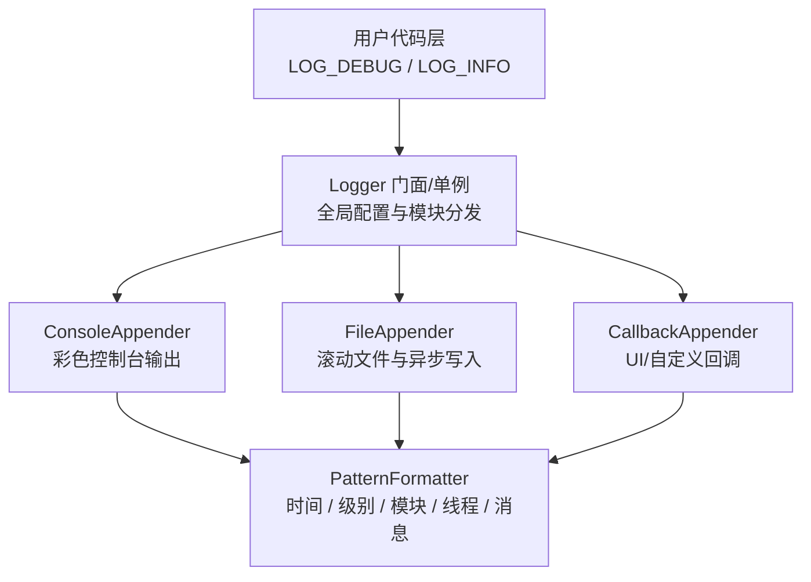

# EasyKiConverter 日志架构设计

## 1. 设计目标

### 1.1 核心需求
- **多级别日志**：TRACE < DEBUG < INFO < WARN < ERROR < FATAL
- **模块分类**：按功能模块过滤日志（Network、Export、UI 等）
- **多输出目标**：控制台、文件、自定义回调
- **线程安全**：支持多线程并发日志输出
- **性能优化**：异步写入、零拷贝、条件求值
- **上下文信息**：时间戳、线程 ID、源码位置、模块名
- **运行时配置**：动态调整日志级别和输出目标

### 1.2 设计原则
- **零开销**：日志禁用时无性能损耗
- **易迁移**：提供兼容 Qt 日志的适配器
- **可扩展**：支持自定义 Formatter、Appender
- **类型安全**：使用模板避免格式化错误

---

## 2. 架构概览


<!-- Legacy ASCII diagram retained below for historical reference.
┌─────────────────────────────────────────────────────────────────┐
│                        用户代码层                                │
│   LOG_DEBUG(Module::Network, "Fetching data from {}", url)      │
└─────────────────────────────────────────────────────────────────┘
                                │
                                ▼
┌─────────────────────────────────────────────────────────────────┐
│                      Logger (门面/单例)                          │
│  - 管理全局配置                                                   │
│  - 分发日志到各 Appender                                          │
│  - 维护模块级别映射                                                │
└─────────────────────────────────────────────────────────────────┘
                                │
                ┌───────────────┼───────────────┐
                ▼               ▼               ▼
┌───────────────────┐ ┌───────────────────┐ ┌───────────────────┐
│  ConsoleAppender  │ │   FileAppender    │ │  CallbackAppender │
│  - 彩色输出        │ │  - 滚动文件       │ │  - 自定义处理      │
│  - 格式化         │ │  - 异步写入       │ │  - UI 集成        │
└───────────────────┘ └───────────────────┘ └───────────────────┘
                                │
                                ▼
┌─────────────────────────────────────────────────────────────────┐
│                      Formatter (格式化器)                        │
│  PatternFormatter: [时间] [级别] [模块] [线程] 消息 (文件:行)     │
└─────────────────────────────────────────────────────────────────┘
```
-->

---

## 3. 核心组件设计

### 3.1 日志级别 (LogLevel)

```cpp
enum class LogLevel {
    Trace = 0,   // 详细追踪信息（仅开发调试）
    Debug = 1,   // 调试信息
    Info = 2,    // 常规运行信息
    Warn = 3,    // 警告信息
    Error = 4,   // 错误信息
    Fatal = 5,   // 致命错误
    Off = 6      // 关闭日志
};
```

### 3.2 模块定义 (LogModule)

```cpp
// 预定义模块（支持按模块过滤）
enum class LogModule : uint32_t {
    None      = 0,
    Core      = 1 << 0,   // 核心功能
    Network   = 1 << 1,   // 网络请求
    Export    = 1 << 2,   // 导出功能
    UI        = 1 << 3,   // 用户界面
    Parser    = 1 << 4,   // 数据解析
    KiCad     = 1 << 5,   // KiCad 导出
    EasyEDA   = 1 << 6,   // EasyEDA API
    Pipeline  = 1 << 7,   // 流水线
    Worker    = 1 << 8,   // 工作线程
    Config    = 1 << 9,   // 配置管理
    I18N      = 1 << 10,  // 国际化
    All       = 0xFFFFFFFF
};
// 支持位运算组合：LogModule::Network | LogModule::Export
```

### 3.3 日志记录 (LogRecord)

```cpp
struct LogRecord {
    LogLevel level;
    LogModule module;
    QString message;
    QString fileName;
    QString functionName;
    int line;
    Qt::HANDLE threadId;
    qint64 timestamp;      // 毫秒级时间戳
    QString threadName;    // 可选：线程名称
};
```

### 3.4 格式化器接口 (Formatter)

```cpp
class IFormatter {
public:
    virtual ~IFormatter() = default;
    virtual QString format(const LogRecord& record) = 0;
    virtual QString formatHeader() { return QString(); }
};

// 默认模式格式化器
class PatternFormatter : public IFormatter {
    // 支持占位符：
    // %{timestamp}  - 时间戳 (2024-01-15 10:30:45.123)
    // %{level}      - 日志级别 (DEBUG/WARN/ERROR)
    // %{module}     - 模块名 (Network/Export)
    // %{thread}     - 线程 ID
    // %{file}       - 文件名
    // %{line}       - 行号
    // %{function}   - 函数名
    // %{message}    - 日志消息
    
    // 默认模式: "[%{timestamp}] [%{level}] [%{module}] [%{thread}] %{message} (%{file}:%{line})"
};
```

### 3.5 输出器接口 (Appender)

```cpp
class IAppender {
public:
    virtual ~IAppender() = default;
    virtual void append(const LogRecord& record, const QString& formatted) = 0;
    virtual void flush() {}
    virtual void setFormatter(QSharedPointer<IFormatter> formatter) {
        m_formatter = formatter;
    }
    
protected:
    QSharedPointer<IFormatter> m_formatter;
};

// 控制台输出器（支持彩色）
class ConsoleAppender : public IAppender {
    // 根据日志级别着色：Trace(灰), Debug(青), Info(白), Warn(黄), Error(红), Fatal(红底白字)
};

// 文件输出器（支持滚动）
class FileAppender : public IAppender {
    // 特性：
    // - 按大小滚动（默认 10MB）
    // - 按时间滚动（每日/每小时）
    // - 保留历史文件数量限制
    // - 异步写入队列
};

// 回调输出器（用于 UI 集成）
class CallbackAppender : public IAppender {
    // 支持将日志转发到 QML UI 的日志查看器
};
```

### 3.6 日志管理器 (Logger)

```cpp
class Logger : public QObject {
    Q_OBJECT
    
public:
    static Logger* instance();
    
    // 配置
    void setGlobalLevel(LogLevel level);
    void setModuleLevel(LogModule module, LogLevel level);
    void addAppender(QSharedPointer<IAppender> appender);
    void removeAppender(QSharedPointer<IAppender> appender);
    
    // 核心日志方法
    void log(LogLevel level, LogModule module, const QString& message,
              const char* file = nullptr, const char* function = nullptr, int line = 0);
    
    // 级别检查（用于条件求值优化）
    bool shouldLog(LogLevel level, LogModule module) const;
    
    // 刷新所有 Appender
    void flush();
    
    // 性能追踪
    void traceBegin(const QString& operation);
    void traceEnd(const QString& operation);
    
signals:
    void logRecord(const LogRecord& record);
    
private:
    LogLevel m_globalLevel = LogLevel::Info;
    QHash<LogModule, LogLevel> m_moduleLevels;
    QList<QSharedPointer<IAppender>> m_appenders;
    mutable QMutex m_mutex;
    
    // 异步写入队列
    BoundedThreadSafeQueue<LogRecord> m_asyncQueue;
    QThread* m_writerThread;
};
```

---

## 4. 宏定义

### 4.1 基础日志宏

```cpp
// 基础宏（支持模块过滤）
#define LOG_TRACE(module, ...)    EasyKiConverter::Logger::instance()->log( \
    EasyKiConverter::LogLevel::Trace, module, \
    EasyKiConverter::LogUtils::format(__VA_ARGS__), \
    __FILE__, __FUNCTION__, __LINE__)

#define LOG_DEBUG(module, ...)    EasyKiConverter::Logger::instance()->log( \
    EasyKiConverter::LogLevel::Debug, module, \
    EasyKiConverter::LogUtils::format(__VA_ARGS__), \
    __FILE__, __FUNCTION__, __LINE__)

#define LOG_INFO(module, ...)     EasyKiConverter::Logger::instance()->log( \
    EasyKiConverter::LogLevel::Info, module, \
    EasyKiConverter::LogUtils::format(__VA_ARGS__), \
    __FILE__, __FUNCTION__, __LINE__)

#define LOG_WARN(module, ...)     EasyKiConverter::Logger::instance()->log( \
    EasyKiConverter::LogLevel::Warn, module, \
    EasyKiConverter::LogUtils::format(__VA_ARGS__), \
    __FILE__, __FUNCTION__, __LINE__)

#define LOG_ERROR(module, ...)    EasyKiConverter::Logger::instance()->log( \
    EasyKiConverter::LogLevel::Error, module, \
    EasyKiConverter::LogUtils::format(__VA_ARGS__), \
    __FILE__, __FUNCTION__, __LINE__)

#define LOG_FATAL(module, ...)    EasyKiConverter::Logger::instance()->log( \
    EasyKiConverter::LogLevel::Fatal, module, \
    EasyKiConverter::LogUtils::format(__VA_ARGS__), \
    __FILE__, __FUNCTION__, __LINE__)
```

### 4.2 条件日志宏（性能优化）

```cpp
// 仅当日志级别启用时才求值参数
#define LOG_DEBUG_IF(module, condition, ...) \
    do { \
        if (EasyKiConverter::Logger::instance()->shouldLog( \
            EasyKiConverter::LogLevel::Debug, module) && (condition)) { \
            LOG_DEBUG(module, __VA_ARGS__); \
        } \
    } while(0)
```

### 4.3 性能追踪宏

```cpp
#define LOG_TRACE_SCOPE(module, operation) \
    EasyKiConverter::ScopedTracer _scopedTracer(module, operation)

#define LOG_TIME(module, operation) \
    EasyKiConverter::TimeLogger _timeLogger(module, operation)
```

### 4.4 兼容 Qt 日志的适配器

```cpp
// 重定向 qDebug/qWarning/qCritical 到新日志系统
void installQtLogHandler();
// 原有 qDebug() 调用会自动转换为 LOG_DEBUG()
```

---

## 5. 使用示例

### 5.1 基本使用

```cpp
#include "utils/Logger.h"

using namespace EasyKiConverter;

void FetchWorker::fetchData(const QString& url) {
    LOG_INFO(LogModule::Network, "Starting fetch from: {}", url);
    
    if (url.isEmpty()) {
        LOG_WARN(LogModule::Network, "Empty URL provided");
        return;
    }
    
    try {
        // ... 网络请求 ...
        LOG_DEBUG(LogModule::Network, "Received {} bytes", data.size());
    } catch (const std::exception& e) {
        LOG_ERROR(LogModule::Network, "Fetch failed: {}", e.what());
    }
}
```

### 5.2 性能追踪

```cpp
void ExportServicePipeline::exportComponents() {
    LOG_TRACE_SCOPE(LogModule::Pipeline, "exportComponents");
    // 或
    LOG_TIME(LogModule::Pipeline, "exportComponents");
    
    // 函数退出时自动打印耗时
}
```

### 5.3 初始化配置

```cpp
// main.cpp
void setupLogging() {
    auto logger = Logger::instance();
    
    // 设置全局级别
    logger->setGlobalLevel(LogLevel::Debug);
    
    // 设置模块级别（网络模块仅记录 Info 及以上）
    logger->setModuleLevel(LogModule::Network, LogLevel::Info);
    
    // 添加控制台输出
    auto consoleAppender = QSharedPointer<ConsoleAppender>::create();
    consoleAppender->setFormatter(QSharedPointer<PatternFormatter>::create(
        "[%{timestamp}] [%{level}] [%{module}] %{message}"
    ));
    logger->addAppender(consoleAppender);
    
    // 添加文件输出
    auto fileAppender = QSharedPointer<FileAppender>::create(
        "logs/easykiconverter.log",
        10 * 1024 * 1024,  // 10MB
        5                   // 保留 5 个历史文件
    );
    logger->addAppender(fileAppender);
    
    // 安装 Qt 日志适配器
    installQtLogHandler();
}
```

---

## 6. 文件结构

```
src/utils/
├── Logger.h              # 主头文件（包含宏定义）
├── Logger.cpp            # Logger 实现
├── LogLevel.h            # 日志级别定义
├── LogModule.h           # 模块定义
├── LogRecord.h           # 日志记录结构
├── formatters/
│   ├── IFormatter.h      # 格式化器接口
│   └── PatternFormatter.h/cpp
└── appenders/
    ├── IAppender.h       # 输出器接口
    ├── ConsoleAppender.h/cpp
    ├── FileAppender.h/cpp
    └── CallbackAppender.h/cpp
```

---

## 7. 配置文件支持

```json
// config/logging.json
{
    "globalLevel": "Debug",
    "moduleLevels": {
        "Network": "Info",
        "Export": "Debug",
        "UI": "Warn"
    },
    "appenders": [
        {
            "type": "console",
            "pattern": "[%{timestamp}] [%{level}] [%{module}] %{message}",
            "colors": true
        },
        {
            "type": "file",
            "path": "logs/app.log",
            "maxSize": 10485760,
            "maxFiles": 5,
            "async": true
        }
    ]
}
```

---

## 8. 性能考虑

### 8.1 零开销原则
- 使用 `shouldLog()` 在参数求值前检查级别
- 编译期可完全移除特定级别的日志代码

### 8.2 异步写入
- 文件 Appender 使用后台线程写入
- 使用无锁队列 (BoundedThreadSafeQueue) 减少锁竞争

### 8.3 内存优化
- 使用 QString 的隐式共享 (Copy-on-Write)
- 限制异步队列大小防止内存溢出

---

## 9. 迁移计划

### 9.1 第一阶段：基础设施
1. 实现核心 Logger、LogLevel、LogModule
2. 实现 ConsoleAppender 和 PatternFormatter
3. 提供 Qt 日志适配器

### 9.2 第二阶段：功能完善
1. 实现 FileAppender（滚动、异步）
2. 实现 CallbackAppender（UI 集成）
3. 添加配置文件支持

### 9.3 第三阶段：迁移现有代码
1. 批量替换 `qDebug()` → `LOG_DEBUG(module, ...)`
2. 批量替换 `qWarning()` → `LOG_WARN(module, ...)`
3. 批量替换 `qCritical()` → `LOG_ERROR(module, ...)`

### 9.4 第四阶段：高级功能
1. 添加性能追踪 (ScopedTracer)
2. 添加远程日志上传（可选）
3. 添加日志查看器 UI（可选）

---

## 10. 日志级别使用指南

| 级别 | 使用场景 | 示例 |
|------|----------|------|
| Trace | 详细执行流程、变量状态 | `LOG_TRACE(Network, "HTTP header: {}", header)` |
| Debug | 开发调试信息 | `LOG_DEBUG(Export, "Exporting {} symbols", count)` |
| Info | 正常运行状态 | `LOG_INFO(Pipeline, "Export started for {} components", count)` |
| Warn | 潜在问题、降级处理 | `LOG_WARN(Parser, "Unknown layer {}, using default", id)` |
| Error | 错误但可恢复 | `LOG_ERROR(Network, "Request failed: {}", error)` |
| Fatal | 致命错误、程序即将退出 | `LOG_FATAL(Core, "Failed to initialize: {}", reason)` |

---

## 11. 模块使用指南

| 模块 | 包含范围 |
|------|----------|
| Core | main.cpp、LanguageManager、核心工具 |
| Network | NetworkUtils、FetchWorker、所有网络请求 |
| Export | ExportService、ExportWorker、导出流程 |
| UI | ViewModels、QML 交互 |
| Parser | BOM 解析、JSON 解析、数据转换 |
| KiCad | Symbol/Footprint/3D 导出器 |
| EasyEDA | EasyEDA API 集成 |
| Pipeline | 流水线管理、Worker 协调 |
| Worker | 所有 Worker 线程 |
| Config | ConfigService、配置管理 |
| I18N | 翻译、语言管理 |
