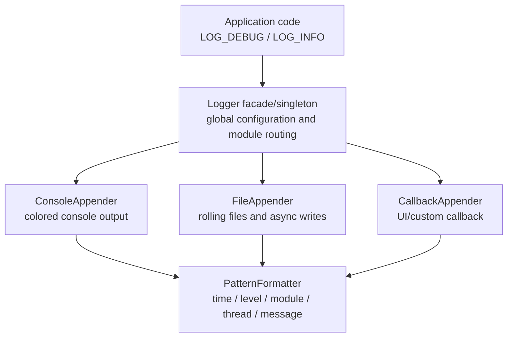

# EasyKiConverter Logging Architecture Design

## 1. Design Goals

### 1.1 Core Requirements
- **Multi-level logs**: TRACE < DEBUG < INFO < WARN < ERROR < FATAL
- **Module classification**: Filter logs by functional module (Network, Export, UI, etc.)
- **Multiple output targets**: Console, file, custom callbacks
- **Thread safety**: Support multi-threaded concurrent log output
- **Performance optimization**: Async writes, zero-copy, conditional evaluation
- **Context information**: Timestamp, thread ID, source location, module name
- **Runtime configuration**: Dynamically adjust log levels and output targets

### 1.2 Design Principles
- **Zero overhead**: No performance loss when logging is disabled
- **Easy migration**: Provide Qt logging compatible adapter
- **Extensibility**: Support custom Formatter and Appender
- **Type safety**: Use templates to avoid formatting errors

---

## 2. Architecture Overview


<!-- Legacy ASCII diagram retained below for historical reference.
┌─────────────────────────────────────────────────────────────────┐
│                        User Code Layer                           │
│   LOG_DEBUG(Module::Network, "Fetching data from {}", url)     │
└─────────────────────────────────────────────────────────────────┘
                                │
                                ▼
┌─────────────────────────────────────────────────────────────────┐
│                      Logger (Facade/Singleton)                  │
│  - Manages global configuration                                  │
│  - Dispatches logs to each Appender                            │
│  - Maintains module level mapping                              │
└─────────────────────────────────────────────────────────────────┘
                                │
                ┌───────────────┼───────────────┐
                ▼               ▼               ▼
┌───────────────────┐ ┌───────────────────┐ ┌───────────────────┐
│  ConsoleAppender │ │   FileAppender    │ │  CallbackAppender │
│  - Colored output │ │  - Rotating files │ │  - Custom handling│
│  - Formatting    │ │  - Async writes   │ │  - UI integration │
└───────────────────┘ └───────────────────┘ └───────────────────┘
                                │
                                ▼
┌─────────────────────────────────────────────────────────────────┐
│                      Formatter                                   │
│  PatternFormatter: [time] [level] [module] [thread] message    │
└─────────────────────────────────────────────────────────────────┘
```
-->

---

## 3. Core Component Design

### 3.1 Log Level (LogLevel)

```cpp
enum class LogLevel {
    Trace = 0,   // Detailed trace info (development debugging only)
    Debug = 1,    // Debug info
    Info = 2,     // Normal operation info
    Warn = 3,     // Warning info
    Error = 4,    // Error info
    Fatal = 5,    // Fatal error
    Off = 6       // Turn off logging
};
```

### 3.2 Module Definition (LogModule)

```cpp
// Predefined modules (supports module-level filtering)
enum class LogModule : uint32_t {
    None      = 0,
    Core      = 1 << 0,   // Core functionality
    Network   = 1 << 1,   // Network requests
    Export    = 1 << 2,   // Export functionality
    UI        = 1 << 3,   // User interface
    Parser    = 1 << 4,   // Data parsing
    KiCad     = 1 << 5,   // KiCad export
    EasyEDA   = 1 << 6,   // EasyEDA API
    Pipeline  = 1 << 7,   // Pipeline
    Worker    = 1 << 8,   // Worker threads
    Config    = 1 << 9,   // Configuration management
    I18N      = 1 << 10,  // Internationalization
    All       = 0xFFFFFFFF
};
// Supports bitwise combination: LogModule::Network | LogModule::Export
```

### 3.3 Log Record (LogRecord)

```cpp
struct LogRecord {
    LogLevel level;
    LogModule module;
    QString message;
    QString fileName;
    QString functionName;
    int line;
    Qt::HANDLE threadId;
    qint64 timestamp;      // Millisecond timestamp
    QString threadName;    // Optional: thread name
};
```

### 3.4 Formatter Interface

```cpp
class IFormatter {
public:
    virtual ~IFormatter() = default;
    virtual QString format(const LogRecord& record) = 0;
    virtual QString formatHeader() { return QString(); }
};

// Default pattern formatter
class PatternFormatter : public IFormatter {
    // Supported placeholders:
    // %{timestamp}  - Timestamp (2024-01-15 10:30:45.123)
    // %{level}      - Log level (DEBUG/WARN/ERROR)
    // %{module}     - Module name (Network/Export)
    // %{thread}     - Thread ID
    // %{file}       - File name
    // %{line}       - Line number
    // %{function}   - Function name
    // %{message}    - Log message

    // Default pattern: "[%{timestamp}] [%{level}] [%{module}] [%{thread}] %{message} (%{file}:%{line})"
};
```

### 3.5 Appender Interface

```cpp
class IAppender {
public:
    virtual ~IAppender() = default;
    virtual void append(const LogRecord& record, const QString& formatted) = 0;
    virtual void flush() {}
    virtual void setFormatter(QSharedPointer<IFormatter> formatter) {
        m_formatter = formatter;
    }

protected:
    QSharedPointer<IFormatter> m_formatter;
};

// Console appender (colored output)
class ConsoleAppender : public IAppender {
    // Color by level: Trace(gray), Debug(cyan), Info(white), Warn(yellow), Error(red), Fatal(red bg white text)
};

// File appender (with rotation)
class FileAppender : public IAppender {
    // Features:
    // - Size-based rotation (default 10MB)
    // - Time-based rotation (daily/hourly)
    // - History file count limit
    // - Async write queue
};

// Callback appender (for UI integration)
class CallbackAppender : public IAppender {
    // Supports forwarding logs to QML UI log viewer
};
```

### 3.6 Log Manager (Logger)

```cpp
class Logger : public QObject {
    Q_OBJECT

public:
    static Logger* instance();

    // Configuration
    void setGlobalLevel(LogLevel level);
    void setModuleLevel(LogModule module, LogLevel level);
    void addAppender(QSharedPointer<IAppender> appender);
    void removeAppender(QSharedPointer<IAppender> appender);

    // Core logging method
    void log(LogLevel level, LogModule module, const QString& message,
             const char* file = nullptr, const char* function = nullptr, int line = 0);

    // Level check (for conditional evaluation optimization)
    bool shouldLog(LogLevel level, LogModule module) const;

    // Flush all appenders
    void flush();

    // Performance tracking
    void traceBegin(const QString& operation);
    void traceEnd(const QString& operation);

signals:
    void logRecord(const LogRecord& record);

private:
    LogLevel m_globalLevel = LogLevel::Info;
    QHash<LogModule, LogLevel> m_moduleLevels;
    QList<QSharedPointer<IAppender>> m_appenders;
    mutable QMutex m_mutex;

    // Async write queue
    BoundedThreadSafeQueue<LogRecord> m_asyncQueue;
    QThread* m_writerThread;
};
```

---

## 4. Macro Definitions

### 4.1 Basic Logging Macros

```cpp
// Basic macro (with module filtering)
#define LOG_TRACE(module, ...)    EasyKiConverter::Logger::instance()->log( \
    EasyKiConverter::LogLevel::Trace, module, \
    EasyKiConverter::LogUtils::format(__VA_ARGS__), \
    __FILE__, __FUNCTION__, __LINE__)

#define LOG_DEBUG(module, ...)    EasyKiConverter::Logger::instance()->log( \
    EasyKiConverter::LogLevel::Debug, module, \
    EasyKiConverter::LogUtils::format(__VA_ARGS__), \
    __FILE__, __FUNCTION__, __LINE__)

#define LOG_INFO(module, ...)     EasyKiConverter::Logger::instance()->log( \
    EasyKiConverter::LogLevel::Info, module, \
    EasyKiConverter::LogUtils::format(__VA_ARGS__), \
    __FILE__, __FUNCTION__, __LINE__)

#define LOG_WARN(module, ...)     EasyKiConverter::Logger::instance()->log( \
    EasyKiConverter::LogLevel::Warn, module, \
    EasyKiConverter::LogUtils::format(__VA_ARGS__), \
    __FILE__, __FUNCTION__, __LINE__)

#define LOG_ERROR(module, ...)    EasyKiConverter::Logger::instance()->log( \
    EasyKiConverter::LogLevel::Error, module, \
    EasyKiConverter::LogUtils::format(__VA_ARGS__), \
    __FILE__, __FUNCTION__, __LINE__)

#define LOG_FATAL(module, ...)    EasyKiConverter::Logger::instance()->log( \
    EasyKiConverter::LogLevel::Fatal, module, \
    EasyKiConverter::LogUtils::format(__VA_ARGS__), \
    __FILE__, __FUNCTION__, __LINE__)
```

### 4.2 Conditional Logging Macros (Performance Optimization)

```cpp
// Only evaluate parameters when log level is enabled
#define LOG_DEBUG_IF(module, condition, ...) \
    do { \
        if (EasyKiConverter::Logger::instance()->shouldLog( \
            EasyKiConverter::LogLevel::Debug, module) && (condition)) { \
            LOG_DEBUG(module, __VA_ARGS__); \
        } \
    } while(0)
```

### 4.3 Performance Tracking Macros

```cpp
#define LOG_TRACE_SCOPE(module, operation) \
    EasyKiConverter::ScopedTracer _scopedTracer(module, operation)

#define LOG_TIME(module, operation) \
    EasyKiConverter::TimeLogger _timeLogger(module, operation)
```

### 4.4 Qt Logging Compatibility Adapter

```cpp
// Redirect qDebug/qWarning/qCritical to new logging system
void installQtLogHandler();
// Original qDebug() calls will automatically convert to LOG_DEBUG()
```

---

## 5. Usage Examples

### 5.1 Basic Usage

```cpp
#include "utils/Logger.h"

using namespace EasyKiConverter;

void FetchWorker::fetchData(const QString& url) {
    LOG_INFO(LogModule::Network, "Starting fetch from: {}", url);

    if (url.isEmpty()) {
        LOG_WARN(LogModule::Network, "Empty URL provided");
        return;
    }

    try {
        // ... network request ...
        LOG_DEBUG(LogModule::Network, "Received {} bytes", data.size());
    } catch (const std::exception& e) {
        LOG_ERROR(LogModule::Network, "Fetch failed: {}", e.what());
    }
}
```

### 5.2 Performance Tracking

```cpp
void ExportServicePipeline::exportComponents() {
    LOG_TRACE_SCOPE(LogModule::Pipeline, "exportComponents");
    // or
    LOG_TIME(LogModule::Pipeline, "exportComponents");

    // Automatically prints elapsed time when function exits
}
```

### 5.3 Initialization Configuration

```cpp
// main.cpp
void setupLogging() {
    auto logger = Logger::instance();

    // Set global level
    logger->setGlobalLevel(LogLevel::Debug);

    // Set module level (Network module only logs Info and above)
    logger->setModuleLevel(LogModule::Network, LogLevel::Info);

    // Add console appender
    auto consoleAppender = QSharedPointer<ConsoleAppender>::create();
    consoleAppender->setFormatter(QSharedPointer<PatternFormatter>::create(
        "[%{timestamp}] [%{level}] [%{module}] %{message}"
    ));
    logger->addAppender(consoleAppender);

    // Add file appender
    auto fileAppender = QSharedPointer<FileAppender>::create(
        "logs/easykiconverter.log",
        10 * 1024 * 1024,  // 10MB
        5                   // Keep 5 history files
    );
    logger->addAppender(fileAppender);

    // Install Qt logging adapter
    installQtLogHandler();
}
```

---

## 6. File Structure

```
src/utils/
├── Logger.h              # Main header (includes macro definitions)
├── Logger.cpp            # Logger implementation
├── LogLevel.h           # Log level definitions
├── LogModule.h          # Module definitions
├── LogRecord.h          # Log record structure
├── formatters/
│   ├── IFormatter.h     # Formatter interface
│   └── PatternFormatter.h/cpp
└── appenders/
    ├── IAppender.h       # Appender interface
    ├── ConsoleAppender.h/cpp
    ├── FileAppender.h/cpp
    └── CallbackAppender.h/cpp
```

---

## 7. Configuration File Support

```json
// config/logging.json
{
    "globalLevel": "Debug",
    "moduleLevels": {
        "Network": "Info",
        "Export": "Debug",
        "UI": "Warn"
    },
    "appenders": [
        {
            "type": "console",
            "pattern": "[%{timestamp}] [%{level}] [%{module}] %{message}",
            "colors": true
        },
        {
            "type": "file",
            "path": "logs/app.log",
            "maxSize": 10485760,
            "maxFiles": 5,
            "async": true
        }
    ]
}
```

---

## 8. Performance Considerations

### 8.1 Zero Overhead Principle
- Use `shouldLog()` to check level before parameter evaluation
- Compiler can completely remove specific level log code at compile time

### 8.2 Async Writes
- File appender uses background thread for writing
- Use lock-free queue (BoundedThreadSafeQueue) to reduce lock contention

### 8.3 Memory Optimization
- Use QString's implicit sharing (Copy-on-Write)
- Limit async queue size to prevent memory overflow

---

## 9. Migration Plan

### Phase 1: Infrastructure
1. Implement core Logger, LogLevel, LogModule
2. Implement ConsoleAppender and PatternFormatter
3. Provide Qt logging adapter

### Phase 2: Feature Completion
1. Implement FileAppender (rotation, async)
2. Implement CallbackAppender (UI integration)
3. Add configuration file support

### Phase 3: Migrate Existing Code
1. Batch replace `qDebug()` → `LOG_DEBUG(module, ...)`
2. Batch replace `qWarning()` → `LOG_WARN(module, ...)`
3. Batch replace `qCritical()` → `LOG_ERROR(module, ...)`

### Phase 4: Advanced Features
1. Add performance tracking (ScopedTracer)
2. Add remote log upload (optional)
3. Add log viewer UI (optional)

---

## 10. Log Level Usage Guide

| Level | When to Use | Example |
|-------|-------------|---------|
| Trace | Detailed execution flow, variable state | `LOG_TRACE(Network, "HTTP header: {}", header)` |
| Debug | Development debugging info | `LOG_DEBUG(Export, "Exporting {} symbols", count)` |
| Info | Normal operation status | `LOG_INFO(Pipeline, "Export started for {} components", count)` |
| Warn | Potential issues, degraded mode | `LOG_WARN(Parser, "Unknown layer {}, using default", id)` |
| Error | Errors but recoverable | `LOG_ERROR(Network, "Request failed: {}", error)` |
| Fatal | Fatal errors, program about to exit | `LOG_FATAL(Core, "Failed to initialize: {}", reason)` |

---

## 11. Module Usage Guide

| Module | Scope |
|--------|-------|
| Core | main.cpp, LanguageManager, core utilities |
| Network | NetworkUtils, FetchWorker, all network requests |
| Export | ExportService, ExportWorker, export process |
| UI | ViewModels, QML interaction |
| Parser | BOM parsing, JSON parsing, data conversion |
| KiCad | Symbol/Footprint/3D exporters |
| EasyEDA | EasyEDA API integration |
| Pipeline | Pipeline management, Worker coordination |
| Worker | All Worker threads |
| Config | ConfigService, configuration management |
| I18N | Translation, language management |
