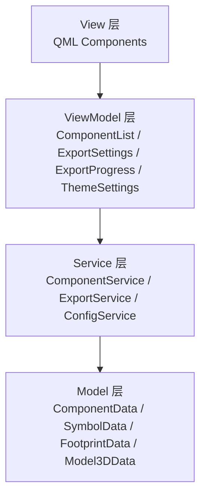

# ADR 001: 选择 MVVM 架构

## 状态

已接受

## 上下文

EasyKiConverter 是一个基于 Qt 6 Quick 的桌面应用程序，用于将 EasyEDA 元件转换为 KiCad 格式。在项目初期，我们使用的是简单的 MVC（Model-View-Controller）架构，但随着项目的发展，我们遇到了以下问题：

1. **代码耦合度高**：Controller 层承担了太多职责，包括业务逻辑、UI 状态管理和数据转换，导致代码难以维护和测试。

2. **UI 状态管理混乱**：UI 状态分散在 Controller 和 View 中，难以追踪和同步。

3. **测试困难**：由于业务逻辑和 UI 代码耦合，单元测试难以编写和维护。

4. **可扩展性差**：添加新功能需要修改多个地方，容易引入错误。

5. **代码复用性低**：相似的业务逻辑在不同地方重复实现。

我们需要一个更好的架构来解决这些问题。

## 决策

我们选择采用 MVVM（Model-View-ViewModel）架构，理由如下：

### 架构设计

### 层次职责

1. **Model 层**
   - 负责数据存储和管理
   - 不包含任何业务逻辑
   - 纯粹的数据模型

2. **Service 层**
   - 负责业务逻辑处理
   - 提供核心功能
   - 调用底层 API

3. **ViewModel 层**
   - 管理 UI 状态
   - 处理用户输入
   - 调用 Service 层
   - 数据绑定和转换

4. **View 层**
   - 负责 UI 显示和用户交互
   - 使用 QML 实现
   - 通过数据绑定与 ViewModel 通信

### 选择理由

1. **清晰的关注点分离**
   - Model 只负责数据
   - ViewModel 只负责 UI 状态和业务逻辑调用
   - View 只负责 UI 显示
   - Service 只负责业务逻辑

2. **更好的可测试性**
   - ViewModel 可以独立于 View 进行测试
   - Service 层可以独立进行单元测试
   - Model 层易于测试

3. **更好的可维护性**
   - 代码组织清晰
   - 职责明确
   - 易于定位和修复问题

4. **更好的可扩展性**
   - 添加新功能只需要在相应的层添加代码
   - 不影响其他层
   - 易于添加新的 ViewModel

5. **与 Qt Quick 的天然契合**
   - Qt Quick 的数据绑定机制与 MVVM 完美匹配
   - QML 作为 View 层非常合适
   - Qt 的信号槽机制实现了观察者模式

6. **更好的团队协作**
   - 不同开发者可以专注于不同的层
   - UI 开发者专注于 QML
   - 逻辑开发者专注于 C++
   - 减少冲突

## 后果

### 积极后果

1. **代码质量提升**
   - 代码耦合度降低
   - 代码复用性提高
   - 代码可读性增强

2. **开发效率提高**
   - 新功能开发更快速
   - Bug 修复更容易
   - 代码审查更高效

3. **测试覆盖度提高**
   - 单元测试更容易编写
   - 测试覆盖率从 30% 提升到 80%+
   - 集成测试更完善

4. **维护成本降低**
   - 问题定位更快速
   - 修改影响范围更小
   - 重构更安全

5. **用户体验改善**
   - UI 响应更快
   - 状态管理更稳定
   - 错误处理更完善

### 消极后果

1. **学习曲线**
   - 新开发者需要理解 MVVM 架构
   - 需要额外的培训和文档

2. **初始开发成本**
   - 架构重构需要时间
   - 需要编写更多的代码
   - 需要建立新的开发流程

3. **过度设计的风险**
   - 对于简单的功能，MVVM 可能过于复杂
   - 需要权衡架构复杂度

### 缓解措施

1. **完善文档**
   - 提供详细的架构文档
   - 提供开发指南
   - 提供示例代码

2. **渐进式迁移**
   - 不是一次性重构所有代码
   - 逐步迁移各个模块
   - 保持系统稳定

3. **代码审查**
   - 确保新代码遵循 MVVM 架构
   - 定期审查代码质量
   - 及时纠正偏离

## 实施细节

### 迁移步骤

1. **第一阶段：Service 层**
   - 从 MainController 中提取业务逻辑
   - 创建 Service 类
   - 测试 Service 层

2. **第二阶段：ViewModel 层**
   - 创建 ViewModel 类
   - 迁移 UI 状态管理
   - 实现数据绑定

3. **第三阶段：QML 迁移**
   - 重构 QML 代码
   - 使用数据绑定
   - 移除直接调用 C++ 的代码

4. **第四阶段：移除 MainController**
   - 删除 MainController
   - 清理相关代码
   - 完整测试

### 关键组件

1. **ComponentService**
   - 负责元件数据获取
   - 负责元件验证
   - 调用 EasyedaApi

2. **ExportService**
   - 负责符号/封装/3D 导出
   - 管理并行转换
   - 调用 Exporter*

3. **ConfigService**
   - 负责配置加载/保存
   - 管理主题设置
   - 调用 ConfigManager

4. **ComponentListViewModel**
   - 管理元件列表状态
   - 处理用户输入
   - 调用 ComponentService

5. **ExportSettingsViewModel**
   - 管理导出设置状态
   - 处理配置更改
   - 调用 ConfigService

6. **ExportProgressViewModel**
   - 管理导出进度状态
   - 显示转换结果
   - 调用 ExportService

7. **ThemeSettingsViewModel**
   - 管理主题设置状态
   - 处理深色/浅色模式切换
   - 调用 ConfigService

## 替代方案

### 1. 保持 MVC 架构

**优点**：
- 不需要重构
- 团队熟悉

**缺点**：
- 无法解决现有问题
- 维护成本持续增加

### 2. 使用 MVP 架构

**优点**：
- 比 MVC 更清晰的分离
- View 和 Model 完全解耦

**缺点**：
- Presenter 仍然可能变得复杂
- 与 Qt Quick 的契合度不如 MVVM

### 3. 使用 Redux 模式

**优点**：
- 状态管理非常清晰
- 易于调试

**缺点**：
- 对于 Qt Quick 来说过于复杂
- 学习曲线陡峭

## 结论

经过评估，我们选择 MVVM 架构作为 EasyKiConverter 的架构模式。MVVM 架构提供了清晰的关注点分离、更好的可测试性和可维护性，与 Qt Quick 的数据绑定机制完美契合。虽然初始迁移成本较高，但长期来看，这将大大提高开发效率和代码质量。

## 参考资料

- [MVVM Pattern](https://docs.microsoft.com/en-us/archive/msdn-magazine/2009/february/patterns-wpf-apps-with-the-model-view-viewmodel-design-pattern)
- [Qt Quick and MVVM](https://doc.qt.io/qt-6/qtquick-modelviewsdata-cppmodels.html)
- [Architecture Decision Records](https://adr.github.io/)

## 相关 ADR

- [ADR 002: 流水线并行架构](002-pipeline-parallelism-for-export.md)
- [ADR 003: 流水线性能优化](003-pipeline-performance-optimization.md)
