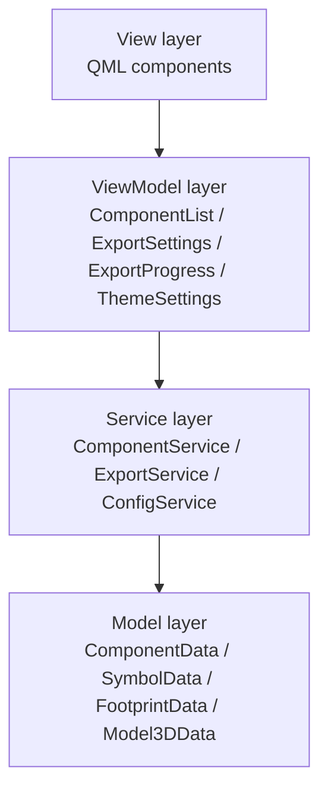

# ADR 001: Choose MVVM Architecture

## Status

Accepted

## Context

EasyKiConverter is a Qt 6 Quick-based desktop application for converting EasyEDA components to KiCad format. In the early stages of the project, we used a simple MVC (Model-View-Controller) architecture. However, as the project evolved, we encountered the following issues:

1. **High Code Coupling**: The Controller layer took on too many responsibilities, including business logic, UI state management, and data transformation, making the code difficult to maintain and test.

2. **Chaotic UI State Management**: UI state was scattered between Controller and View, making it difficult to track and synchronize.

3. **Difficult Testing**: Due to the coupling of business logic and UI code, unit tests were difficult to write and maintain.

4. **Poor Scalability**: Adding new features required modifications in multiple places, easily introducing errors.

5. **Low Code Reusability**: Similar business logic was implemented repeatedly in different places.

We needed a better architecture to solve these problems.

## Decision

We chose to adopt the MVVM (Model-View-ViewModel) architecture for the following reasons:

### Architecture Design

### Layer Responsibilities

1. **Model Layer**
   - Responsible for data storage and management
   - Contains no business logic
   - Pure data models

2. **Service Layer**
   - Responsible for business logic processing
   - Provides core functionality
   - Calls underlying APIs

3. **ViewModel Layer**
   - Manages UI state
   - Handles user input
   - Calls Service layer
   - Data binding and transformation

4. **View Layer**
   - Responsible for UI display and user interaction
   - Implemented using QML
   - Communicates with ViewModel through data binding

### Reasons for Choice

1. **Clear Separation of Concerns**
   - Model only handles data
   - ViewModel only handles UI state and business logic calls
   - View only handles UI display
   - Service only handles business logic

2. **Better Testability**
   - ViewModels can be tested independently of View
   - Service layer can be unit tested independently
   - Model layer is easy to test

3. **Better Maintainability**
   - Clear code organization
   - Clear responsibilities
   - Easy to locate and fix issues

4. **Better Scalability**
   - Adding new features only requires adding code in the appropriate layer
   - Does not affect other layers
   - Easy to add new ViewModels

5. **Natural Fit with Qt Quick**
   - Qt Quick's data binding mechanism perfectly matches MVVM
   - QML is very suitable as the View layer
   - Qt's signal-slot mechanism implements the observer pattern

6. **Better Team Collaboration**
   - Different developers can focus on different layers
   - UI developers focus on QML
   - Logic developers focus on C++
   - Reduces conflicts

## Consequences

### Positive Consequences

1. **Improved Code Quality**
   - Reduced code coupling
   - Improved code reusability
   - Enhanced code readability

2. **Increased Development Efficiency**
   - Faster development of new features
   - Easier bug fixes
   - More efficient code reviews

3. **Improved Test Coverage**
   - Unit tests are easier to write
   - Test coverage increased from 30% to 80%+
   - More comprehensive integration tests

4. **Reduced Maintenance Costs**
   - Faster problem location
   - Smaller scope of changes
   - Safer refactoring

5. **Improved User Experience**
   - Faster UI response
   - More stable state management
   - More comprehensive error handling

### Negative Consequences

1. **Learning Curve**
   - New developers need to understand MVVM architecture
   - Requires additional training and documentation

2. **Initial Development Cost**
   - Architecture refactoring takes time
   - Requires writing more code
   - Needs to establish new development processes

3. **Risk of Over-engineering**
   - MVVM may be too complex for simple features
   - Need to balance architecture complexity

### Mitigation Measures

1. **Comprehensive Documentation**
   - Provide detailed architecture documentation
   - Provide development guides
   - Provide example code

2. **Gradual Migration**
   - Not refactoring all code at once
   - Migrating modules gradually
   - Maintaining system stability

3. **Code Reviews**
   - Ensure new code follows MVVM architecture
   - Regularly review code quality
   - Timely correction of deviations

## Implementation Details

### Migration Steps

1. **Phase 1: Service Layer**
   - Extract business logic from MainController
   - Create Service classes
   - Test Service layer

2. **Phase 2: ViewModel Layer**
   - Create ViewModel classes
   - Migrate UI state management
   - Implement data binding

3. **Phase 3: QML Migration**
   - Refactor QML code
   - Use data binding
   - Remove code that directly calls C++

4. **Phase 4: Remove MainController**
   - Delete MainController
   - Clean up related code
   - Complete testing

### Key Components

1. **ComponentService**
   - Responsible for component data retrieval
   - Responsible for component validation
   - Calls EasyedaApi

2. **ExportService**
   - Responsible for symbol/footprint/3D export
   - Manages parallel conversion
   - Calls Exporter*

3. **ConfigService**
   - Responsible for configuration load/save
   - Manages theme settings
   - Calls ConfigManager

4. **ComponentListViewModel**
   - Manages component list state
   - Handles user input
   - Calls ComponentService

5. **ExportSettingsViewModel**
   - Manages export settings state
   - Handles configuration changes
   - Calls ConfigService

6. **ExportProgressViewModel**
   - Manages export progress state
   - Displays conversion results
   - Calls ExportService

7. **ThemeSettingsViewModel**
   - Manages theme settings state
   - Handles dark/light mode toggle
   - Calls ConfigService

## Alternatives

### 1. Keep MVC Architecture

**Pros**:
- No refactoring needed
- Team is familiar with it

**Cons**:
- Cannot solve existing problems
- Maintenance costs continue to increase

### 2. Use MVP Architecture

**Pros**:
- Clearer separation than MVC
- View and Model completely decoupled

**Cons**:
- Presenter may still become complex
- Less natural fit with Qt Quick than MVVM

### 3. Use Redux Pattern

**Pros**:
- Very clear state management
- Easy to debug

**Cons**:
- Too complex for Qt Quick
- Steep learning curve

## Conclusion

After evaluation, we chose MVVM architecture as the architecture pattern for EasyKiConverter. MVVM architecture provides clear separation of concerns, better testability, and maintainability, and perfectly matches Qt Quick's data binding mechanism. Although the initial migration cost is high, in the long run, this will greatly improve development efficiency and code quality.

## References

- [MVVM Pattern](https://docs.microsoft.com/en-us/archive/msdn-magazine/2009/february/patterns-wpf-apps-with-the-model-view-viewmodel-design-pattern)
- [Qt Quick and MVVM](https://doc.qt.io/qt-6/qtquick-modelviewsdata-cppmodels.html)
- [Architecture Decision Records](https://adr.github.io/)

## Related ADRs

- [ADR 002: Pipeline Parallelism Architecture](002-pipeline-parallelism-for-export_en.md)
- [ADR 003: Pipeline Performance Optimization](003-pipeline-performance-optimization_en.md)
