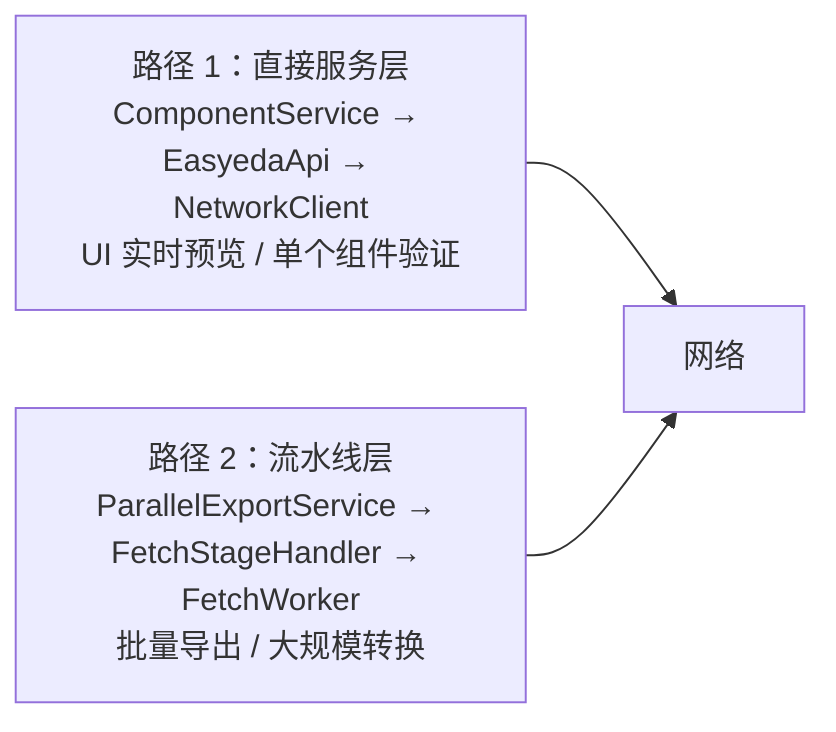
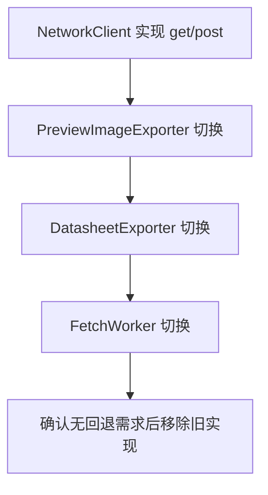
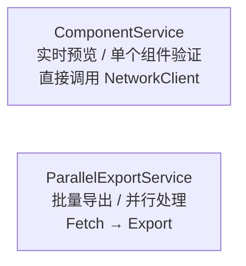

# ADR 009: 网络层架构整合与状态管理统一

## 状态

提议 (2026-04-07)

## 背景

项目经过多次迭代，积累了三类架构问题：

### 1. 网络层代码重复

项目存在 **5+ 套独立的网络请求实现**，gzip 解压在 4 处重复，QNetworkAccessManager 创建 8+ 个独立实例：

| 类 | 文件 | QNAM 管理方式 | 超时 | 重试策略 |
|---|------|--------------|------|----------|
| `NetworkUtils` | `core/utils/` | 单例 `this` | 60s | 5次，状态码 429/5xx |
| `NetworkWorker` | `workers/` | 每次请求新建 | QTimer | 3次，{3s,5s,10s} |
| `FetchWorker` | `workers/` | `thread_local unique_ptr` | 8-10s | 3次，超时不重试 |
| `LcscImageService` | `services/` | 单例 `this` | 15-45s | 3次 |
| `ComponentCacheService` | `services/` | 每次请求新建 | 45s | 无 |
| `PreviewImageExporter` | `services/` | 外部注入 | **无** | **无** |
| `DatasheetExporter` | `services/` | 外部注入 | **无** | **无** |
| `ComponentService` | `services/` | 成员变量 `this` | 多种 | 多种 |

**具体重复代码：**
- `decompressGzip()` 在 `NetworkUtils.cpp:355-387`、`NetworkWorker.cpp:271-340`、`FetchWorker.cpp:478-521` 重复，chunkSize 不一致（4096 vs 8192）
- 重试延迟表 `RETRY_DELAYS_MS[]{3000, 5000, 10000}` 在 `FetchWorker.h:119` 和 `NetworkWorker.h:153` 重复定义

### 2. 两套并行架构做同一件事



`EasyedaApi::fetchCadData()` 与 `FetchWorker::run()` 功能高度重叠，但实现独立。

### 3. 状态管理问题

**澄清：经代码核实，`ComponentDataCollector` 是死代码，从未被实例化。**

实际状态管理只有一套：`ComponentService::FetchingComponent` 结构。

```cpp
// ComponentService.h - 实际使用的状态跟踪
struct FetchingComponent {
    bool hasComponentInfo;
    bool hasCadData;
    bool hasObjData;
    bool hasStepData;
};
QMap<QString, FetchingComponent> m_fetchingComponents;
```

**真正的问题：**
- `ComponentDataCollector` 是废弃但未删除的死代码，需清理
- `FetchingComponent` 缺少状态转换验证，可能导致无效状态

### 4. QRunnable auto-delete 不一致且存在双重删除风险

```cpp
// FetchStageHandler.cpp:233 - 双重删除风险
connect(worker, &FetchWorker::fetchCompleted, worker, &QObject::deleteLater, Qt::QueuedConnection);
// FetchWorker 本身 setAutoDelete(false)，但信号触发 deleteLater()

// ProcessStageHandler.cpp:54 - 同样问题
connect(worker, &ProcessWorker::processCompleted, worker, &QObject::deleteLater, Qt::QueuedConnection);

// WriteStageHandler.cpp:77 - 正确的注释
// 注意：不能使用 deleteLater()，因为 QThreadPool 已经拥有 worker 的所有权
```

### 5. 错误信号签名混乱

| 组件 | 信号 | 参数 |
|------|------|------|
| `EasyedaApi` | `fetchError` | `(QString)` 或 `(QString, QString)` 重载并存 |
| `NetworkWorker` | `fetchError` | `(QString, QString)` |
| `LcscImageService` | `error` | `(QString, QString)` |
| `ComponentService` | `fetchError` | 两种重载并存 |

## 决策

### 阶段 0：准备与验证（1 周）

**目标：在正式开始迁移前验证方案可行性**

#### 0.1 统一 gzip 实现为独立工具函数

仅提取 `decompressGzip()` 为独立函数，不改变任何调用方：

```cpp
// src/core/utils/GzipUtils.h
namespace GzipUtils {
    QByteArray decompress(const QByteArray& data);
    bool isGzipped(const QByteArray& data);
}
```

#### 0.2 建立性能基准测试

测量现有网络层性能，作为迁移后对比依据：
- 单组件 fetch 延迟（平均、RTT P99）
- 批量导出吞吐量
- 内存占用基线
- 弱网模拟测试（P99 延迟 > 5s 场景）
- 内存泄漏检测基准

### 阶段 1：统一网络层（3-4 周）

#### 1.1 创建 INetworkClient 接口 + NetworkClient 单例

```cpp
// src/core/network/INetworkClient.h
class INetworkClient {
public:
    virtual ~INetworkClient() = default;
    virtual Result get(const QUrl& url, const RetryPolicy& policy = {}) = 0;
    virtual Result post(const QUrl& url, const QByteArray& body, const RetryPolicy& policy = {}) = 0;
};

// src/core/network/NetworkClient.h
class NetworkClient : public INetworkClient {
public:
    static NetworkClient& instance();

    // 实现 INetworkClient 接口
    Result get(const QUrl& url, const RetryPolicy& policy = {}) override;
    Result post(const QUrl& url, const QByteArray& body, const RetryPolicy& policy = {}) override;

    // 统一 gzip 解压
    static QByteArray decompressGzip(const QByteArray& data);
    static bool isGzipCompressed(const QByteArray& data);

    // 可测试性
    void setInstance(INetworkClient* mock);

private:
    static NetworkClient* s_instance;
    static INetworkClient* s_mockInstance;  // 测试用 mock（通过 instance() 中的 mutex 保证线程安全）
};
```

**设计理由：**
- 接口模式支持 Mock，便于测试
- 单例模式确保全局共享 QNetworkAccessManager（连接池复用）
- 静态工具方法用于 gzip 等纯函数

#### 1.2 渐进式迁移策略



#### 1.3 迁移优先级

| 原组件 | 迁移目标 | 优先级 | 原因 |
|--------|----------|--------|------|
| `DatasheetExporter` | `INetworkClient` | P0 | 无超时保护，最危险 |
| `PreviewImageExporter` | `INetworkClient` | P0 | 无超时保护 |
| `FetchWorker` | `INetworkClient` | P0 | 核心组件 |
| `NetworkWorker` | `INetworkClient` | P1 | 功能重叠 |
| `LcscImageService` | `INetworkClient` | P1 | 次要组件 |
| `ComponentCacheService` | `INetworkClient` | P2 | 缓存服务，可延后 |

### 阶段 2：清理死代码（0.5 周）

#### 2.1 移除 ComponentDataCollector

`ComponentDataCollector` 从未被实例化，是死代码：

```bash
# 验证无调用点
grep -r "new ComponentDataCollector" src/  # 无结果
grep -r "ComponentDataCollector" src/ --include="*.cpp" | grep -v "ComponentDataCollector\.(cpp|h):"  # 无结果
```

**操作：**
1. 从 `CMakeLists.txt` 移除
2. 删除 `src/services/ComponentDataCollector.cpp` 和 `.h`

### 阶段 3：架构清理（2 周）

#### 3.1 明确职责边界



#### 3.2 统一错误信号

```cpp
// src/core/network/NetworkError.h
class NetworkError {
public:
    enum class Severity { Info, Warning, Error, Critical };
    enum class Category { Network, Parsing, Validation, System };

    QString componentId;
    QString message;
    Severity severity;
    Category category;
    int statusCode;
    qint64 timestamp;
    QMap<QString, QString> details;
};

// 所有网络组件统一使用
void errorOccurred(const NetworkError& error);
void retryAttempt(const QString& componentId, int attempt, int maxAttempts);
```

### 阶段 4：生命周期标准化和测试（2 周）

#### 4.1 标准化 QRunnable 生命周期

**澄清：auto-delete 和 deleteLater() 不能同时使用。**

选择策略：**Qt::QueuedConnection + deleteLater()**

```cpp
// 所有 Worker 统一
class BaseWorker : public QObject, public QRunnable {
protected:
    BaseWorker() {
        setAutoDelete(false);  // 由 QThreadPool + deleteLater() 管理
    }
    virtual ~BaseWorker() = default;
};

// 调用方
connect(worker, &Worker::completed, worker, &QObject::deleteLater, Qt::QueuedConnection);
QThreadPool::globalInstance()->start(worker);
```

**理由：**
- `setAutoDelete(true)` 由 QThreadPool 管理生命周期，容易与 `deleteLater()` 冲突
- `setAutoDelete(false)` + 显式 `deleteLater()` 更可控

#### 4.2 使 Singleton 可测试

```cpp
// src/utils/TestableSingleton.h
template<typename T>
class TestableSingleton {
public:
    static T& instance() {
        if (s_mockInstance) return *s_mockInstance;
        if (!s_instance) s_instance = new T();
        return *s_instance;
    }
    static void destroyInstance() {
        delete s_instance;
        s_instance = nullptr;
    }
    static void setMockInstance(T* mock) {  // 用于测试
        s_mockInstance = mock;
    }
protected:
    TestableSingleton() = default;
    virtual ~TestableSingleton() = default;
private:
    static T* s_instance;
    static T* s_mockInstance;
};
```

#### 4.3 添加架构测试

- 检测 gzip 重复的静态分析规则
- 检测信号签名一致性的测试
- 网络层性能回归测试

## 后果

### 正面

1. **消除代码重复**：网络层代码量预计减少 40%
2. **统一行为**：所有网络请求一致的超时/重试/退避策略
3. **移除死代码**：`ComponentDataCollector` 删除，减少维护负担
4. **提高可测试性**：接口模式支持 Mock 注入
5. **消除双重删除风险**：明确 QRunnable 生命周期策略

### 负面

1. **迁移成本高**：需要修改 6+ 个文件
2. **短期风险**：迁移过程中可能引入新 bug
3. **学习曲线**：团队需要理解新的抽象层

### 风险

1. **向后兼容性**：接口设计需仔细考虑，保持向后兼容
2. **性能影响**：需测量单例模式是否影响性能
3. **测试覆盖**：渐进式迁移期间保持旧实现作为 fallback

## 实施计划

| 阶段 | 内容 | 建议时间 | 验收标准 |
|------|------|----------|----------|
| 阶段 0 | 准备与验证（gzip 提取 + 性能基准） | 1 周 | gzip 统一，基准数据建立 |
| 阶段 1 | INetworkClient 实现 + 渐进迁移 | 3-4 周 | 所有网络请求通过 NetworkClient |
| 阶段 2 | 移除 ComponentDataCollector | 0.5 周 | 死代码已删除 |
| 阶段 3 | 职责边界明确 + 错误信号统一 | 2 周 | 代码审查无架构违规 |
| 阶段 4 | 生命周期标准化 + 测试 | 2 周 | 单元测试覆盖率 > 80% |

**总计：8.5-9.5 周**（原估算 7 周偏乐观）

## 参考文档

- [ADR-006: 网络性能优化](006-network-performance-optimization.md)
- [ADR-007: 弱网容错分析](007-weak-network-resilience-analysis.md)
- [弱网支持分析报告](../archive/WEAK_NETWORK_ANALYSIS.md)
- [架构文档](../../developer/ARCHITECTURE.md)
