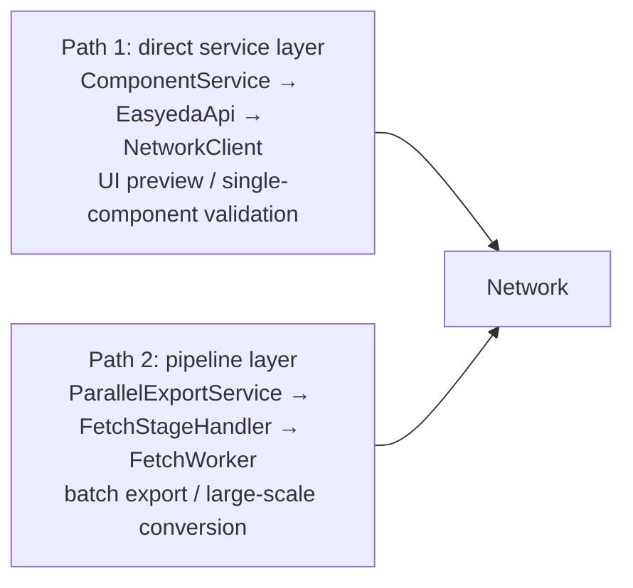
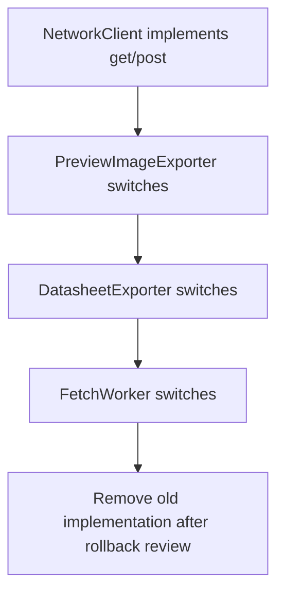
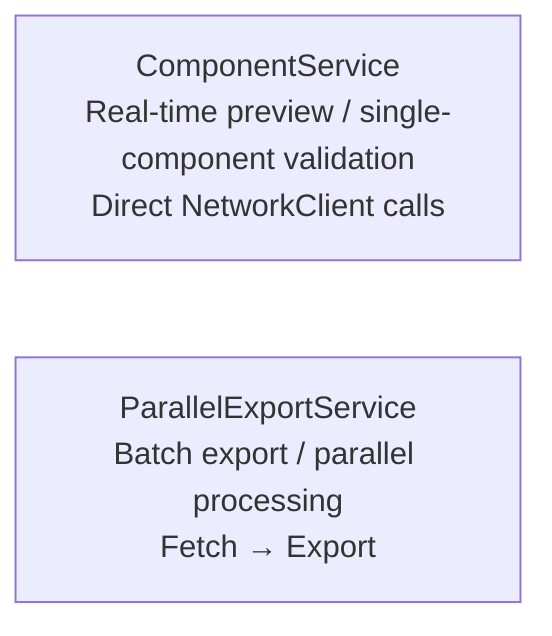

# ADR 009: Network Layer Consolidation and State Management Unification

## Status

**Implemented** (2026-04-15)

## Context

After multiple iterations, the project has accumulated three types of architectural problems:

### 1. Network Layer Code Duplication

The project has **5+ independent network request implementations**, gzip decompression duplicated in 4 places, and 8+ independent QNetworkAccessManager instances:

| Class | File | QNAM Management | Timeout | Retry Strategy |
|-------|------|----------------|---------|-----------------|
| `NetworkUtils` | `core/utils/` | Singleton `this` | 60s | 5x, status 429/5xx |
| `NetworkWorker` | `workers/` | New per request | QTimer | 3x, {3s,5s,10s} |
| `FetchWorker` | `workers/` | `thread_local unique_ptr` | 8-10s | 3x, no retry on timeout |
| `LcscImageService` | `services/` | Singleton `this` | 15-45s | 3x |
| `ComponentCacheService` | `services/` | New per download | 45s | None |
| `PreviewImageExporter` | `services/` | External injection | **None** | **None** |
| `DatasheetExporter` | `services/` | External injection | **None** | **None** |
| `ComponentService` | `services/` | Member `this` | Various | Various |

### 2. Two Parallel Architectures Doing the Same Thing



`EasyedaApi::fetchCadData()` and `FetchWorker::run()` have highly overlapping functionality but independent implementations.

### 3. State Management Issues

**Correction: After code verification, `ComponentDataCollector` is dead code and has never been instantiated.**

The actual state management is a single system: `ComponentService::FetchingComponent`.

```cpp
// ComponentService.h - Actual state tracking in use
struct FetchingComponent {
    bool hasComponentInfo;
    bool hasCadData;
    bool hasObjData;
    bool hasStepData;
};
QMap<QString, FetchingComponent> m_fetchingComponents;
```

**Real problems:**
- `ComponentDataCollector` is obsolete but not deleted - dead code that needs cleanup
- `FetchingComponent` lacks state transition validation, potentially leading to invalid states

### 4. QRunnable Auto-delete Inconsistent with Double-Delete Risk

```cpp
// FetchStageHandler.cpp:233 - Double delete risk
connect(worker, &FetchWorker::fetchCompleted, worker, &QObject::deleteLater, Qt::QueuedConnection);
// FetchWorker itself has setAutoDelete(false), but signal triggers deleteLater()

// ProcessStageHandler.cpp:54 - Same issue
connect(worker, &ProcessWorker::processCompleted, worker, &QObject::deleteLater, Qt::QueuedConnection);

// WriteStageHandler.cpp:77 - Correct comment
// Note: Cannot use deleteLater() because QThreadPool already owns worker ownership
```

### 5. Inconsistent Error Signal Signatures

| Component | Signal | Parameters |
|-----------|--------|------------|
| `EasyedaApi` | `fetchError` | `(QString)` or `(QString, QString)` overloads coexist |
| `NetworkWorker` | `fetchError` | `(QString, QString)` |
| `LcscImageService` | `error` | `(QString, QString)` |
| `ComponentService` | `fetchError` | Two overloads coexist |

## Decision

### Phase 0: Preparation and Validation (1 week)

**Goal: Verify approach feasibility before formal migration**

#### 0.1 Extract Unified Gzip Implementation as Standalone Utility

Only extract `decompressGzip()` as independent function without changing any callers:

```cpp
// src/core/utils/GzipUtils.h
namespace GzipUtils {
    QByteArray decompress(const QByteArray& data);
    bool isGzipped(const QByteArray& data);
}
```

#### 0.2 Establish Performance Baseline

Measure existing network layer performance as reference for post-migration comparison:
- Single component fetch latency (average, RTT P99)
- Batch export throughput
- Memory usage baseline
- Weak network simulation tests (P99 latency > 5s scenarios)
- Memory leak detection baseline

### Phase 1: Unified Network Layer (3-4 weeks)

#### 1.1 Create INetworkClient Interface + NetworkClient Singleton

```cpp
// src/core/network/INetworkClient.h
class INetworkClient {
public:
    virtual ~INetworkClient() = default;
    virtual Result get(const QUrl& url, const RetryPolicy& policy = {}) = 0;
    virtual Result post(const QUrl& url, const QByteArray& body, const RetryPolicy& policy = {}) = 0;
};

// src/core/network/NetworkClient.h
class NetworkClient : public INetworkClient {
public:
    static NetworkClient& instance();

    // Implement INetworkClient interface
    Result get(const QUrl& url, const RetryPolicy& policy = {}) override;
    Result post(const QUrl& url, const QByteArray& body, const RetryPolicy& policy = {}) override;

    // Unified gzip decompression
    static QByteArray decompressGzip(const QByteArray& data);
    static bool isGzipCompressed(const QByteArray& data);

    // Testability
    void setInstance(INetworkClient* mock);

private:
    static NetworkClient* s_instance;
    static INetworkClient* s_mockInstance;  // For testing (thread-safe via mutex in instance())
};
```

**Design Rationale:**
- Interface pattern supports Mock, facilitating testing
- Singleton ensures global shared QNetworkAccessManager (connection pool reuse)
- Static utility methods for pure functions like gzip

#### 1.2 Gradual Migration Strategy



#### 1.3 Migration Priority

| Original Component | Migration Target | Priority | Reason |
|--------------------|------------------|----------|--------|
| `DatasheetExporter` | `INetworkClient` | P0 | No timeout protection, most dangerous |
| `PreviewImageExporter` | `INetworkClient` | P0 | No timeout protection |
| `FetchWorker` | `INetworkClient` | P0 | Core component |
| `NetworkWorker` | `INetworkClient` | P1 | Overlapping functionality |
| `LcscImageService` | `INetworkClient` | P1 | Secondary component |
| `ComponentCacheService` | `INetworkClient` | P2 | Cache service, can defer |

### Phase 2: Dead Code Cleanup (0.5 week)

#### 2.1 Remove ComponentDataCollector

`ComponentDataCollector` is dead code, never instantiated:

```bash
# Verify no call sites
grep -r "new ComponentDataCollector" src/  # No results
grep -r "ComponentDataCollector" src/ --include="*.cpp" | grep -v "ComponentDataCollector\.(cpp|h):"  # No results
```

**Actions:**
1. Remove from `CMakeLists.txt`
2. Delete `src/services/ComponentDataCollector.cpp` and `.h`

### Phase 3: Architecture Cleanup (2 weeks)

#### 3.1 Define Clear Responsibility Boundaries



#### 3.2 Unified Error Signals

```cpp
// src/core/network/NetworkError.h
class NetworkError {
public:
    enum class Severity { Info, Warning, Error, Critical };
    enum class Category { Network, Parsing, Validation, System };

    QString componentId;
    QString message;
    Severity severity;
    Category category;
    int statusCode;
    qint64 timestamp;
    QMap<QString, QString> details;
};

void errorOccurred(const NetworkError& error);
void retryAttempt(const QString& componentId, int attempt, int maxAttempts);
```

### Phase 4: Lifecycle Standardization and Testing (2 weeks)

#### 4.1 Standardize QRunnable Lifecycle

**Clarification: auto-delete and deleteLater() cannot be used together.**

**Chosen strategy: Qt::QueuedConnection + deleteLater()**

```cpp
// All Workers unify to
class BaseWorker : public QObject, public QRunnable {
protected:
    BaseWorker() {
        setAutoDelete(false);  // Managed by QThreadPool + deleteLater()
    }
    virtual ~BaseWorker() = default;
};

// Caller
connect(worker, &Worker::completed, worker, &QObject::deleteLater, Qt::QueuedConnection);
QThreadPool::globalInstance()->start(worker);
```

**Rationale:**
- `setAutoDelete(true)` managed by QThreadPool easily conflicts with `deleteLater()`
- `setAutoDelete(false)` + explicit `deleteLater()` is more controllable

#### 4.2 Make Singletons Testable

```cpp
// src/utils/TestableSingleton.h
template<typename T>
class TestableSingleton {
public:
    static T& instance() {
        if (s_mockInstance) return *s_mockInstance;
        if (!s_instance) s_instance = new T();
        return *s_instance;
    }
    static void destroyInstance() {
        delete s_instance;
        s_instance = nullptr;
    }
    static void setMockInstance(T* mock) {  // For testing
        s_mockInstance = mock;
    }
protected:
    TestableSingleton() = default;
    virtual ~TestableSingleton() = default;
private:
    static T* s_instance;
    static T* s_mockInstance;
};
```

#### 4.3 Add Architecture Tests

- Static analysis rules to detect gzip duplication
- Tests for signal signature consistency
- Network layer performance regression tests

## Consequences

### Positive

1. **Eliminate code duplication**: Network code size expected to reduce by 40%
2. **Unified behavior**: Consistent timeout/retry/backoff for all network requests
3. **Remove dead code**: `ComponentDataCollector` deletion reduces maintenance burden
4. **Improved testability**: Interface pattern supports Mock injection
5. **Eliminate double-delete risk**: Clear QRunnable lifecycle strategy

### Negative

1. **High migration cost**: Need to modify 6+ files
2. **Short-term risk**: New bugs may be introduced during migration
3. **Learning curve**: Team needs to understand new abstraction layer

### Risks

1. **Backward compatibility**: Interface design needs careful consideration for backward compatibility
2. **Performance impact**: Need to measure if singleton mode affects performance
3. **Test coverage**: Keep old implementation as fallback during gradual migration

## Implementation Plan

| Phase | Content | Suggested Time | Acceptance Criteria |
|-------|---------|----------------|---------------------|
| Phase 0 | Preparation (gzip extraction + baseline) | 1 week | Gzip unified, baseline established |
| Phase 1 | INetworkClient + gradual migration | 3-4 weeks | All network requests go through NetworkClient |
| Phase 2 | Remove ComponentDataCollector | 0.5 week | Dead code deleted |
| Phase 3 | Clear boundaries + error unification | 2 weeks | Code review without architecture violations |
| Phase 4 | Lifecycle standardization + tests | 2 weeks | Unit test coverage > 80% |

**Total: 8.5-9.5 weeks** (original estimate of 7 weeks was optimistic)

## References

- [ADR-006: Network Performance Optimization](006-network-performance-optimization.md)
- [ADR-007: Weak Network Resilience Analysis](007-weak-network-resilience-analysis.md)
- [Weak Network Analysis Report](../archive/WEAK_NETWORK_ANALYSIS_en.md)
- [Architecture Documentation](../../developer/ARCHITECTURE.md)
