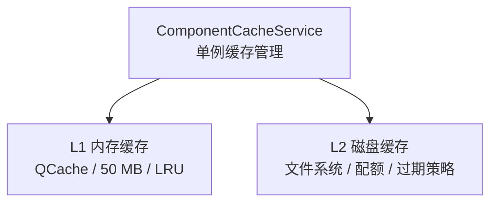

# ADR 010: 组件缓存架构

## 状态

**已实施** (2026-04-15)

## 背景

项目需要管理多种类型的组件数据缓存，包括：
- 元器件元数据 (UUID、制造商信息)
- 符号 CAD 数据 (JSON)
- 封装 CAD 数据 (JSON)
- 预览图 (JPG)
- 数据手册 (PDF/HTML)
- 3D 模型 (STEP/WRL)

缓存需求：
- 减少重复网络请求
- 提升弱网环境下的用户体验
- 支持批量导出时的数据复用

## 决策

### 采用两层缓存架构 (L1 + L2)



### L1 内存缓存

- **存储内容**: 热点数据（UUID、Symbol CAD、Footprint CAD、URLs）
- **大小限制**: 50MB
- **淘汰策略**: LRU (Qt QCache 自动管理)
- **键格式**: `"lcscId:type"` (如 `"C12345:metadata"`)

### L2 磁盘缓存

- **存储内容**: 所有数据
- **配额**: 5GB，超出时 LRU 淘汰
- **淘汰策略**: 按最后访问时间 LRU 淘汰
- **目录结构**:
  ```
  {cacheDir}/
    {lcscId}/
      component.json    # 元数据
      preview_0.jpg     # 预览图0
      preview_1.jpg     # 预览图1
      preview_2.jpg     # 预览图2
      datasheet.pdf     # 数据手册
    model3d/
      {uuid}.step       # 3D STEP模型
      {uuid}.wrl        # 3D WRL模型
  ```

### 核心服务

| 服务 | 职责 | 位置 |
|------|------|------|
| ComponentCacheService | 全局单例缓存管理 | `src/services/` |
| LcscImageService | 预览图/手册下载 | `src/services/` |
| ParallelExportService | 导出管道缓存 | `src/services/export/` |

### 设计约束

1. **锁顺序约定** (防止死锁):
   - 先获取 ComponentCacheService::m_mutex
   - 再获取 ComponentService::m_fetchingComponentsMutex

2. **原子写文件**: 防止半写入导致缓存损坏

3. **启动自修复**: 自动检测并修复损坏的缓存目录

4. **缓存预热**: 导出前批量加载已缓存数据

### 未使用但保留的代码

`ComponentDataCache` 类（`src/services/export/ComponentDataCache.h`）:
- 定义了 L1+L2 缓存接口
- 目前未被实际使用（可能为遗留代码）
- 建议：评估后决定是否移除或重构

## 后果

### 正面

1. **减少网络请求**: 缓存命中时直接返回，无需网络请求
2. **提升弱网体验**: 用户可离线查看已缓存数据
3. **批量导出加速**: 预加载缓存数据到内存
4. **统一管理**: 所有缓存通过 ComponentCacheService 集中管理

### 负面

1. **磁盘空间占用**: 5GB 配额可能较大
2. **缓存一致性**: 需处理缓存过期和更新逻辑

### 风险

1. **缓存损坏**: 异常退出可能导致半写入文件
2. **内存压力**: L1 缓存过大可能影响应用性能

## 相关文件

- `src/services/ComponentCacheService.h` - 主缓存服务
- `src/services/ComponentCacheService.cpp` - 实现
- `src/services/LcscImageService.h` - 预览图服务
- `src/services/export/ComponentDataCache.h` - 未使用的缓存类
- `docs/project/archive/WEAK_NETWORK_ANALYSIS.md` - 弱网历史分析报告

## 后续建议

1. 评估移除未使用的 ComponentDataCache 类
2. 添加缓存统计和监控 UI
3. 实现缓存主动刷新机制
