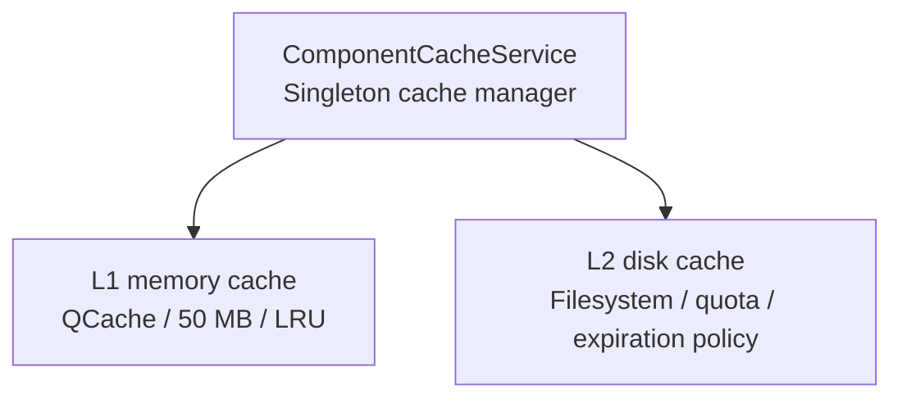

# ADR 010: Component Cache Architecture

## Status

**Implemented** (2026-04-15)

## Context

The project needs to manage multiple types of component data caches, including:
- Component metadata (UUID, manufacturer information)
- Symbol CAD data (JSON)
- Footprint CAD data (JSON)
- Preview images (jpg)
- Datasheets (PDF/HTML)
- 3D models (STEP/WRL)

Cache requirements:
- Reduce redundant network requests
- Improve user experience in weak network environments
- Support data reuse during batch exports

## Decision

### Adopt Two-Layer Cache Architecture (L1 + L2)



### L1 Memory Cache

- **Content**: Hot data (UUID, Symbol CAD, Footprint CAD, URLs)
- **Size Limit**: 50MB
- **Eviction Policy**: LRU (automatically managed by Qt QCache)
- **Key Format**: `"lcscId:type"` (e.g., `"C12345:metadata"`)

### L2 Disk Cache

- **Content**: All data
- **Quota**: 5GB, LRU eviction when exceeded
- **Eviction Policy**: LRU by last access time
- **Directory Structure**:
  ```
  {cacheDir}/
    {lcscId}/
      component.json    # Metadata
      preview_0.jpg     # Preview image 0
      preview_1.jpg     # Preview image 1
      preview_2.jpg     # Preview image 2
      datasheet.pdf     # Datasheet
    model3d/
      {uuid}.step       # 3D STEP model
      {uuid}.wrl        # 3D WRL model
  ```

### Core Services

| Service | Responsibility | Location |
|---------|---------------|----------|
| ComponentCacheService | Global singleton cache management | `src/services/` |
| LcscImageService | Preview image/datasheet download | `src/services/` |
| ParallelExportService | Export pipeline cache | `src/services/export/` |

### Design Constraints

1. **Lock Ordering Convention** (prevents deadlocks):
   - Acquire ComponentCacheService::m_mutex first
   - Then acquire ComponentService::m_fetchingComponentsMutex

2. **Atomic File Writes**: Prevent cache corruption from partial writes

3. **Startup Self-Repair**: Automatically detect and repair corrupted cache directories

4. **Cache Preheating**: Pre-load cached data before export

### Unused but Retained Code

`ComponentDataCache` class (`src/services/export/ComponentDataCache.h`):
- Defines L1+L2 cache interface
- Currently unused (possibly legacy code)
- Recommendation: Evaluate whether to remove or refactor

## Consequences

### Positive

1. **Reduced Network Requests**: Cache hits return directly without network requests
2. **Improved Weak Network Experience**: Users can view cached data offline
3. **Batch Export Acceleration**: Pre-load cached data to memory
4. **Unified Management**: All caches centrally managed through ComponentCacheService

### Negative

1. **Disk Space Usage**: 5GB quota may be large
2. **Cache Consistency**: Need to handle cache expiration and update logic

### Risks

1. **Cache Corruption**: Abnormal exits may cause partially written files
2. **Memory Pressure**: Large L1 cache may affect application performance

## Related Files

- `src/services/ComponentCacheService.h` - Main cache service
- `src/services/ComponentCacheService.cpp` - Implementation
- `src/services/LcscImageService.h` - Preview image service
- `src/services/export/ComponentDataCache.h` - Unused cache class
- `docs/project/archive/WEAK_NETWORK_ANALYSIS_en.md` - Historical weak-network analysis

## Follow-up Recommendations

1. Evaluate removing the unused ComponentDataCache class
2. Add cache statistics and monitoring UI
3. Implement cache active refresh mechanism
