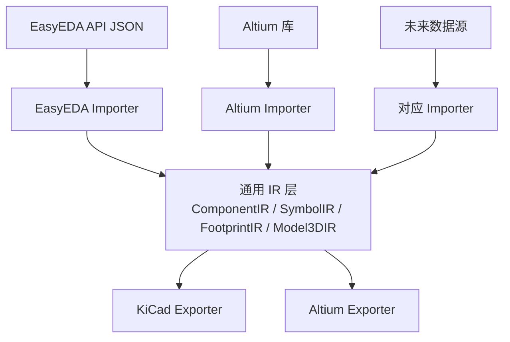

# ADR 012: 中间表示层 (IR) 架构重构

## 状态

**已决策** (2026-07-17)，待实施

## 背景

当前项目的导出流程为：

```
EasyEDA JSON  -->  SymbolData / FootprintData / Model3DData  -->  KiCad / Altium 导出
```

中间的数据模型层（`src/models/`）名义上是中间层，但实际上混入了大量 EasyEDA 特有数据：

1. **元数据污染**：`SymbolInfo` / `FootprintInfo` 包含 EasyEDA 平台字段（`docType`、`datastrid`、`jlcOnSale`、`lcscId`、`supplierPart` 等），与导出逻辑无关
2. **几何数据未解析**：点坐标、路径等以 EasyEDA 原始分隔字符串存储（`QString points = "x1,y1 x2,y2"`），未解析为数值类型
3. **层 ID 硬编码**：使用 EasyEDA 数字层 ID（如 `layerId == 99` 表示 KeepOut），无抽象层
4. **引脚类型强转**：`static_cast<PinType>(settings[2].toInt())` 直接从 EasyEDA 整数映射，无标准化映射
5. **Pad 形状为原始字符串**：`"RECT"`、`"ELLIPSE"` 等未枚举化

这导致：
- 无法接入新的数据源（如 Altium 库导入），因为中间层绑定了 EasyEDA 的数据格式
- 导出器与 EasyEDA 数据格式隐式耦合，测试时必须构造完整的 EasyEDA 数据
- 几何数据以字符串传递，解析分散在多个导出器中重复进行

## 决策

### 引入通用中间表示层 (IR)，实现数据源与导出器的完全解耦

#### 目标架构



#### 核心原则

1. **IR 层零外部依赖**：不包含任何 EasyEDA、Altium、KiCad 特有的常量、字符串格式或平台字段
2. **几何数据已解析**：所有坐标、路径在 IR 中以数值类型存储
3. **类型安全**：枚举替代原始字符串/整数
4. **导入器负责解析**：各数据源的特有格式在各自的 Importer 中完成解析和映射
5. **导出器只消费 IR**：导出器不需要知道数据来源

### 目录结构变更

```
src/core/
├── ir/                              # [新增] 通用中间表示层
│   ├── ComponentIR.h                #   通用组件元数据
│   ├── SymbolIR.h                   #   通用符号数据
│   ├── SymbolIR.cpp
│   ├── FootprintIR.h                #   通用封装数据
│   ├── FootprintIR.cpp
│   ├── Model3DIR.h                  #   通用 3D 模型数据
│   ├── IRTypes.h                    #   通用枚举和类型定义
│   └── CMakeLists.txt
│
├── importers/                       # [新增] 数据源导入器
│   ├── easyeda/                     #   从现有 models/ + EasyedaXxxImporter 迁移
│   │   ├── EasyedaSymbolImporter.h
│   │   ├── EasyedaSymbolImporter.cpp
│   │   ├── EasyedaFootprintImporter.h
│   │   ├── EasyedaFootprintImporter.cpp
│   │   ├── EasyedaMetadata.h        #   EasyEDA 特有元数据结构
│   │   └── CMakeLists.txt
│   └── CMakeLists.txt
│
├── exporters/                       # [重组] 导出器（改消费 IR）
│   ├── kicad/                       #   现有 kicad/ 迁移
│   └── altium/                      #   现有 altium/ 迁移（writers 保留）
│
└── easyeda/                         # [保留] EasyEDA API 客户端（不改动）
```

**删除的目录/文件**：
- `src/models/SymbolData.h/.cpp` → 逻辑拆分到 `ir/SymbolIR.h` + `importers/easyeda/EasyedaSymbolImporter.h`
- `src/models/FootprintData.h/.cpp` → 逻辑拆分到 `ir/FootprintIR.h` + `importers/easyeda/EasyedaFootprintImporter.h`
- `src/models/ComponentData.h/.cpp` → 逻辑拆分到 `ir/ComponentIR.h`
- `src/models/Model3DData.h/.cpp` → 逻辑拆分到 `ir/Model3DIR.h`
- `src/models/SymbolDataSerializer.h/.cpp` → 序列化逻辑合并到 IR 层
- `src/models/FootprintDataSerializer.h/.cpp` → 同上
- `src/models/SymbolPinSerializer.h/.cpp` → 同上
- `src/models/SymbolShapeSerializer.h/.cpp` → 同上

### IR 类型定义 (IRTypes.h)

```cpp
/** @brief 焊盘形状枚举 */
enum class PadShape {
    Rect,           // 矩形
    Ellipse,        // 椭圆/圆形
    RoundedRectangle, // 圆角矩形
    Polygon,        // 多边形（异形焊盘）
    Oblong          // 椭圆长孔
};

/** @brief 引脚电气类型枚举 */
enum class PinElectricalType {
    Input = 0,
    Output,
    Bidirectional,
    Passive,
    Power,
    OpenCollector,
    OpenEmitter,
    Unspecified
};

/** @brief 引脚方向枚举 */
enum class PinDirection {
    Right = 0,
    Left,
    Up,
    Down
};

/** @brief PCB 层类型枚举（EDA 无关） */
enum class LayerType {
    TopCopper,
    BottomCopper,
    TopSilk,
    BottomSilk,
    TopPaste,
    BottomPaste,
    TopMask,
    BottomMask,
    TopOverlay,
    BottomOverlay,
    MultiLayer,
    KeepOut,
    Mechanical1, Mechanical2, /* ... */
    UserDefined               // 扩展用
};

/** @brief Schematic 图形元素类型 */
enum class SchematicRecordType {
    Component,
    Pin,
    Rectangle,
    Circle,
    Arc,
    Ellipse,
    Polygon,
    Polyline,
    Path,
    Text,
    Label,
    Wire,
    Junction,
    Implementation    // 封装链接
};
```

### SymbolIR 数据结构 (SymbolIR.h)

```cpp
/** @brief 通用符号引脚 */
struct SymbolPinIR {
    QString name;                    // 引脚名（如 "VCC", "A0"）
    QString designator;              // 引脚编号（如 "1", "2"）
    QPointF position;                // 位置（已解析数值）
    double length;                   // 引脚长度
    PinDirection direction;          // 方向
    PinElectricalType electricalType;// 电气类型
    bool showName;                   // 是否显示名称
    bool showDesignator;             // 是否显示编号
};

/** @brief 通用符号矩形 */
struct SymbolRectangleIR {
    QRectF bounds;                   // 已解析的边界矩形
    QColor strokeColor;
    double strokeWidth;
    QColor fillColor;
    bool isFilled;
};

/** @brief 通用符号多边形 */
struct SymbolPolygonIR {
    QList<QPointF> points;           // 已解析的顶点列表（非字符串）
    QColor strokeColor;
    double strokeWidth;
    QColor fillColor;
    bool isFilled;
};

/** @brief 通用符号路径（SVG path 解析后） */
struct SymbolPathIR {
    QList<QPointF> points;           // 解析后的坐标序列
    QColor strokeColor;
    double strokeWidth;
    QColor fillColor;
    bool isFilled;
};

// SymbolCircleIR, SymbolArcIR, SymbolEllipseIR, SymbolPolylineIR, SymbolTextIR 类似

/** @brief 通用符号组件 */
struct SymbolComponentIR {
    QString name;                    // 组件名（通用，非 EasyEDA UUID）
    QString description;             // 描述
    QString designatorPrefix;        // 位号前缀（"U", "R", "C"）
    int partCount;                   // 部件数

    // 图形原语
    QList<SymbolPinIR> pins;
    QList<SymbolRectangleIR> rectangles;
    QList<SymbolCircleIR> circles;
    QList<SymbolArcIR> arcs;
    QList<SymbolEllipseIR> ellipses;
    QList<SymbolPolygonIR> polygons;
    QList<SymbolPolylineIR> polylines;
    QList<SymbolPathIR> paths;
    QList<SymbolTextIR> texts;

    // 封装关联
    QString footprintName;           // 关联的封装名称

    // 来源特有数据的扩展点（可选，导出器不应依赖）
    QVariantMap sourceMetadata;      // key-value 扩展，各来源自由填充
};
```

### FootprintIR 数据结构 (FootprintIR.h)

```cpp
/** @brief 通用焊盘 */
struct FootprintPadIR {
    QString padNumber;               // 焊盘编号
    QPointF position;                // 位置（已解析）
    PadShape shape;                  // 形状（枚举，非字符串）
    QSizeF size;                     // 尺寸（top/middle/bottom 统一或分层）
    LayerType layer;                 // 层（枚举，非数字 ID）
    double rotation;                 // 旋转角度
    double holeSize;                 // 孔径（0 = SMD）
    QString netName;                 // 网络名
    bool isSmd() const { return holeSize == 0.0; }
};

/** @brief 通用走线 */
struct FootprintTrackIR {
    QPointF start;                   // 起点（已解析）
    QPointF end;                     // 终点（已解析）
    double width;                    // 线宽
    LayerType layer;
};

/** @brief 通用圆弧 */
struct FootprintArcIR {
    QPointF center;                  // 圆心（已解析）
    double radius;
    double startAngle;
    double endAngle;
    double width;
    LayerType layer;
};

/** @brief 通用实心区域 */
struct FootprintRegionIR {
    QList<QPointF> vertices;         // 顶点列表（已解析，非 SVG 字符串）
    QList<QList<QPointF>> holes;     // 镂空区域
    LayerType layer;
    bool isKeepOut;
};

// FootprintCircleIR, FootprintTextIR, FootprintFillIR 类似

/** @brief 通用封装组件 */
struct FootprintComponentIR {
    QString name;                    // 封装名（通用）
    QString description;
    double height;                   // 3D 高度

    // 图形原语
    QList<FootprintPadIR> pads;
    QList<FootprintTrackIR> tracks;
    QList<FootprintArcIR> arcs;
    QList<FootprintCircleIR> circles;
    QList<FootprintTextIR> texts;
    QList<FootprintFillIR> fills;
    QList<FootprintRegionIR> regions;

    // 3D 模型
    QList<Model3DIR> models3d;

    // 来源扩展
    QVariantMap sourceMetadata;
};
```

### 层 ID 映射策略

各来源在 Importer 中维护自己的映射表：

```cpp
// importers/easyeda/EasyedaLayerMap.h
namespace EasyedaLayerMap {
    /** @brief EasyEDA 数字层 ID -> 通用 LayerType */
    LayerType toLayerType(int easyedaLayerId);
}

// importers/altium/AltiumLayerMap.h（未来）
namespace AltiumLayerMap {
    /** @brief Altium 层名称/ID -> 通用 LayerType */
    LayerType toLayerType(int altiumLayerId);
}
```

### EasyEDA Importer 迁移策略

现有 `EasyedaSymbolImporter` / `EasyedaFootprintImporter` 的职责扩展：

1. **解析 EasyEDA JSON**（现有逻辑保留）
2. **解析几何原始字符串**（从导出器中提取到此处）：
   - `"x1,y1 x2,y2"` -> `QList<QPointF>`
   - `"M x y L x y Z"` -> `QList<QPointF>` (SVG path 解析)
   - `"RECT"` -> `PadShape::Rect`
3. **映射层 ID**（从导出器硬编码移到此处）：
   - `layerId == 99` -> `LayerType::KeepOut`
   - `layerId == 1` -> `LayerType::TopCopper`
4. **映射引脚类型**（从强转改为查表）：
   - `settings[2] == "0"` -> `PinElectricalType::Input`
5. **填充 EasyEDA 特有元数据到 `sourceMetadata`**：
   - `lcscId`、`jlcId` 等放入 `QVariantMap`，导出器按需读取

### 导出器迁移策略

导出器接口变更：

```cpp
// 变更前（消费 EasyEDA 模型）
class ISymbolExporter {
    virtual bool exportSymbol(const SymbolData& data) = 0;
};

// 变更后（消费 IR）
class ISymbolExporter {
    virtual bool exportSymbol(const SymbolComponentIR& ir) = 0;
};
```

导出器内部变更：
- 移除所有 EasyEDA 字符串解析逻辑（已由 Importer 完成）
- 移除 `layerId == 99` 等硬编码判断（已由 Importer 映射）
- 直接使用 `padIR.shape == PadShape::Rect` 而非 `pad.shape == "RECT"`
- 保留 `sourceMetadata` 读取（如 KiCad 导出器需要 `lcscId` 写入字段）

### 数据兼容性

- **缓存兼容**：`FootprintDataSerializer` / `SymbolDataSerializer` 的序列化格式将变更，现有缓存需迁移或标记失效
- **BOM 导入兼容**：BOM 导入路径也消费 `SymbolData`/`FootprintData`，需同步迁移
- **CLI 兼容**：`CliConverter` 的数据流需更新为 IR 管道

## 实施计划

### 第一阶段：IR 类型和几何解析（1 周，低风险）

| 任务 | 文件 | 说明 |
|------|------|------|
| 创建 `IRTypes.h` | `src/core/ir/IRTypes.h` | 定义 `PadShape`、`LayerType`、`PinElectricalType`、`PinDirection` 枚举 |
| 创建 `SymbolIR.h/.cpp` | `src/core/ir/` | `SymbolComponentIR` 及子结构体 |
| 创建 `FootprintIR.h/.cpp` | `src/core/ir/` | `FootprintComponentIR` 及子结构体 |
| 创建 `Model3DIR.h` | `src/core/ir/` | 从现有 `Model3DData` 迁移 |
| 创建 `ComponentIR.h` | `src/core/ir/` | 顶层聚合结构体 |
| 创建 `EasyedaLayerMap.h/.cpp` | `src/core/importers/easyeda/` | EasyEDA 层 ID -> `LayerType` 映射 |
| 创建 `EasyedaPadShapeMap` | `importers/easyeda/` | `"RECT"` -> `PadShape::Rect` 映射 |
| 创建 `EasyedaPinTypeMap` | `importers/easyeda/` | EasyEDA 整数 -> `PinElectricalType` 映射 |
| IR 层单元测试 | `tests/unit/ir/` | 验证结构体构造、枚举值 |

**验证标准**：IR 层编译通过，单元测试通过，不影响现有功能。

### 第二阶段：Importer 迁移（1 周，中风险）

| 任务 | 文件 | 说明 |
|------|------|------|
| 迁移 `EasyedaSymbolImporter` | `src/core/importers/easyeda/` | 输出从 `SymbolData` 改为 `SymbolComponentIR` |
| 迁移 `EasyedaFootprintImporter` | `src/core/importers/easyeda/` | 输出从 `FootprintData` 改为 `FootprintComponentIR` |
| 提取几何解析到 Importer | importers/easyeda/ | 点字符串解析、SVG path 解析从导出器移到此处 |
| 迁移 `CadDataLoader` | `src/core/easyeda/` | 消费 IR 替代旧模型 |
| 移除 `src/models/` 旧结构体 | 删除文件 | 确认无引用后删除 |
| 全量回归测试 | `tests/` | golden file 对比，确保导出结果不变 |

**验证标准**：所有现有测试通过，导出文件 golden file 对比无差异。

### 第三阶段：导出器适配（1 周，中风险）

| 任务 | 文件 | 说明 |
|------|------|------|
| 更新 `ExporterKiCadSymbol` | `src/core/exporters/kicad/` | 消费 `SymbolComponentIR`，移除字符串解析 |
| 更新 `ExporterKiCadFootprint` | `src/core/exporters/kicad/` | 消费 `FootprintComponentIR`，使用 `PadShape` 枚举 |
| 更新 `ExporterAltiumSymbol` | `src/core/exporters/altium/` | 同上 |
| 更新 `ExporterAltiumFootprint` | `src/core/exporters/altium/` | 同上 |
| 更新 ViewModel 层 | `src/ui/viewmodels/` | 适配 IR 数据结构 |
| 更新 Service 层 | `src/services/` | 适配 IR 数据结构 |
| 更新 BOM 导入路径 | `src/services/BomParser.*` | 适配 IR |
| 更新 CLI 路径 | `src/utils/cli/` | 适配 IR |
| 缓存格式迁移 | `ComponentCacheService` | 新增版本号，旧缓存自动失效 |
| 端到端测试 | `tests/integration/` | GUI 和 CLI 全流程验证 |

**验证标准**：GUI 导出、CLI 导出、BOM 导入全链路通过，导出文件与第二阶段一致。

## 后续扩展

IR 架构就绪后，新增数据源的成本显著降低：

| 数据源 | 需要新增的工作 | 预估工作量 |
|--------|--------------|-----------|
| Altium 库导入 | `OLECompoundReader` + `AltiumSchLibReader` + `AltiumPcbLibReader` + `AltiumImporter` | 2-3 周 |
| KiCad 库导入 | KiCad S-expression 解析器 + `KicadImporter` | 1-2 周 |
| Datasheet 格式 | PDF 解析 + `DatasheetImporter` | 按需 |
| 其他 EDA | 只需写 Importer，导出器无需改动 | 按 Importer 复杂度 |

## 影响范围

- **变更文件数**：约 20-25 个（含新增和删除）
- **对外接口**：CLI 参数不变，GUI 操作不变，导出文件格式不变
- **回归风险**：第二阶段（模型切换）风险最高，需 golden file 全量对比
- **不兼容变更**：缓存序列化格式变更，旧缓存需自动失效

## 参考

- [[001-mvvm-architecture]] - 项目整体 MVVM 架构
- [[002-pipeline-parallelism-for-export]] - 导出流水线架构
- [[010-component-cache-architecture]] - 缓存架构（需适配）
- AltiumSharp 项目 (`/home/dennis/Desktop/workspace/github_projects/AltiumSharp`) - Altium 格式参考实现
- 验证工具: `/tmp/validate_altium_lib.py` - OLE 结构验证脚本
