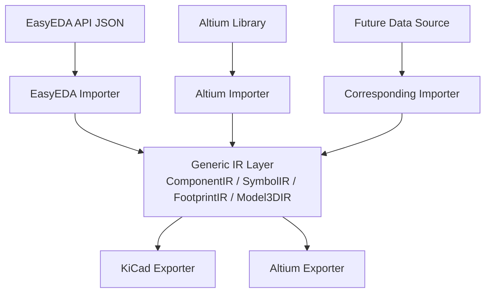

# ADR 012: Intermediate Representation (IR) Architecture Refactoring

## Status

**Decided** (2026-07-17), pending implementation

## Context

The current export pipeline is:

```
EasyEDA JSON  -->  SymbolData / FootprintData / Model3DData  -->  KiCad / Altium Export
```

The data model layer (`src/models/`) is nominally an intermediate layer, but in practice it is heavily contaminated with EasyEDA-specific data:

1. **Metadata pollution**: `SymbolInfo` / `FootprintInfo` contain EasyEDA platform fields (`docType`, `datastrid`, `jlcOnSale`, `lcscId`, `supplierPart`, etc.) irrelevant to export logic
2. **Unparsed geometry**: Point coordinates and paths stored as raw EasyEDA delimited strings (`QString points = "x1,y1 x2,y2"`) instead of numeric types
3. **Hardcoded layer IDs**: Uses EasyEDA numeric layer IDs (e.g. `layerId == 99` for KeepOut) with no abstraction
4. **Unsafe pin type casting**: `static_cast<PinType>(settings[2].toInt())` directly maps from EasyEDA integers without standardized mapping
5. **Raw pad shape strings**: `"RECT"`, `"ELLIPSE"` etc. stored as strings instead of enums

This prevents:
- Integrating new data sources (e.g. Altium library import) since the intermediate layer is bound to EasyEDA's format
- Testing exporters independently, since EasyEDA-specific data must be constructed
- Clean geometry handling, as string parsing is duplicated across exporters

## Decision

### Introduce a generic Intermediate Representation (IR) layer to fully decouple data sources from exporters

#### Target Architecture



#### Core Principles

1. **Zero external dependency in IR**: No EasyEDA, Altium, or KiCad-specific constants, string formats, or platform fields
2. **Parsed geometry**: All coordinates and paths stored as numeric types in IR
3. **Type safety**: Enums replace raw strings and integers
4. **Importers own parsing**: Each data source's format is fully parsed and mapped in its own Importer
5. **Exporters only consume IR**: Exporters have no knowledge of data source format

### Directory Structure Change

```
src/core/
├── ir/                              # [NEW] Generic intermediate representation
│   ├── ComponentIR.h
│   ├── SymbolIR.h / .cpp
│   ├── FootprintIR.h / .cpp
│   ├── Model3DIR.h
│   ├── IRTypes.h                    #   Shared enums and type definitions
│   └── CMakeLists.txt
│
├── importers/                       # [NEW] Data source importers
│   ├── easyeda/                     #   Migrated from existing models/ + EasyedaXxxImporter
│   │   ├── EasyedaSymbolImporter.h / .cpp
│   │   ├── EasyedaFootprintImporter.h / .cpp
│   │   ├── EasyedaMetadata.h        #   EasyEDA-specific metadata struct
│   │   └── CMakeLists.txt
│   └── CMakeLists.txt
│
├── exporters/                       # [REORGANIZED] Exporters consume IR
│   ├── kicad/
│   └── altium/
│
└── easyeda/                         # [KEPT] EasyEDA API client (unchanged)
```

**Deleted files**: `src/models/SymbolData.*`, `FootprintData.*`, `ComponentData.*`, `Model3DData.*`, and all serializers. Logic split into IR types + importer mappings.

### IR Type Definitions (IRTypes.h)

```cpp
enum class PadShape { Rect, Ellipse, RoundedRectangle, Polygon, Oblong };
enum class PinElectricalType { Input, Output, Bidirectional, Passive, Power, OpenCollector, OpenEmitter, Unspecified };
enum class PinDirection { Right, Left, Up, Down };
enum class LayerType {
    TopCopper, BottomCopper, TopSilk, BottomSilk, TopPaste, BottomPaste,
    TopMask, BottomMask, TopOverlay, BottomOverlay, MultiLayer, KeepOut,
    Mechanical1, Mechanical2, /* ... */ UserDefined
};
```

### Implementation Phases

| Phase | Duration | Risk | Scope |
|-------|----------|------|-------|
| 1: IR types + geometry parsing | 1 week | Low | `src/core/ir/`, enum definitions, mapping tables |
| 2: Importer migration | 1 week | Medium | `src/core/importers/easyeda/`, remove old models, golden file validation |
| 3: Exporter adaptation | 1 week | Medium | Exporters consume IR, ViewModel/Service/CLI/BOM adaptation, cache migration |

### Exporter Interface Change

```cpp
// Before (consumes EasyEDA model)
class ISymbolExporter {
    virtual bool exportSymbol(const SymbolData& data) = 0;
};

// After (consumes IR)
class ISymbolExporter {
    virtual bool exportSymbol(const SymbolComponentIR& ir) = 0;
};
```

### Layer ID Mapping Strategy

Each source maintains its own mapping in its Importer:

```cpp
// importers/easyeda/EasyedaLayerMap.h
LayerType toLayerType(int easyedaLayerId);  // 99 -> KeepOut, 1 -> TopCopper

// importers/altium/AltiumLayerMap.h (future)
LayerType toLayerType(int altiumLayerId);
```

## Consequences

### Benefits
- New data source integration cost reduced to writing one Importer class
- Exporters fully decoupled from source format; testable with direct IR construction
- Geometry parsing consolidated in one place instead of duplicated across exporters
- Type-safe enums prevent runtime string comparison errors
- Clear separation of concerns across the codebase

### Costs
- ~20-25 files affected (new + deleted + modified)
- Cache serialization format changes; old cache auto-invalidated
- 3 weeks estimated total implementation time
- Regression risk at Phase 2 (model switchover) requires golden file comparison

### No External Impact
- CLI arguments unchanged
- GUI operation unchanged
- Exported file format unchanged
- No new external dependencies

## Follow-up Opportunities

With IR in place, these become straightforward:

| Data Source | Work Required | Estimate |
|-------------|--------------|----------|
| Altium library import | `OLECompoundReader` + `AltiumSchLibReader` + `AltiumPcbLibReader` + `AltiumImporter` | 2-3 weeks |
| KiCad library import | S-expression parser + `KicadImporter` | 1-2 weeks |
| Other EDA formats | Only Importer needed; exporters untouched | Per importer complexity |

## References

- [[001-mvvm-architecture]] - Project MVVM architecture
- [[002-pipeline-parallelism-for-export]] - Export pipeline architecture
- [[010-component-cache-architecture]] - Cache architecture (needs adaptation)
- AltiumSharp project - Altium format reference implementation
- Validation tool: `/tmp/validate_altium_lib.py` - OLE structure validator
